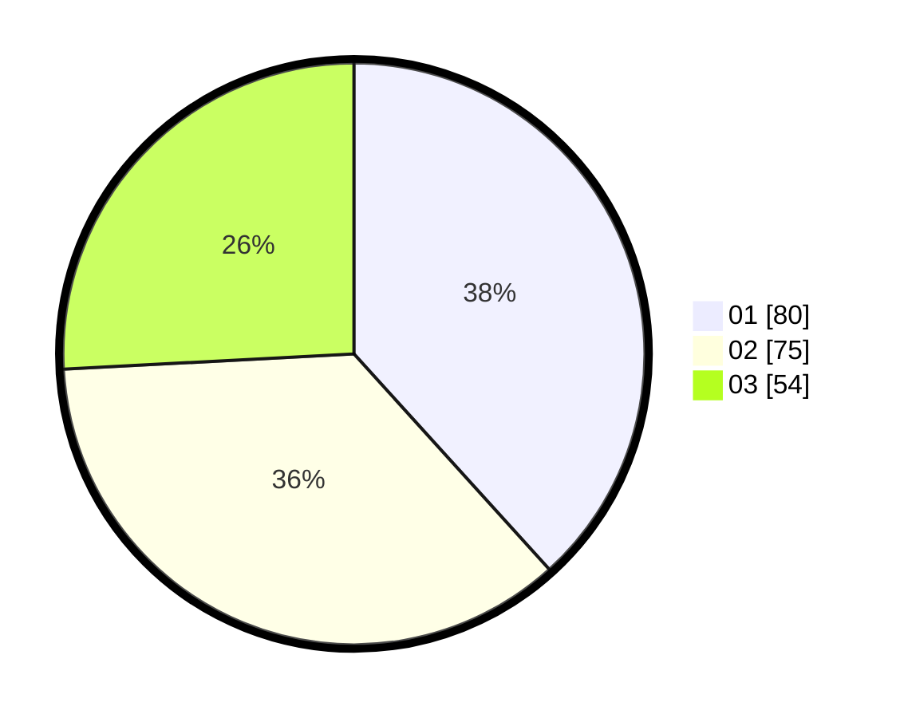

# Hasil

Hasil perolehan suara paslon dapat dilihat pada file paslon-01.txt, paslon-02.txt, dan paslon-03.txt.

Jika tidak ada, artinya data tersebut belum ada pada SIREKAP.

## Perolehan Suara

 * Paslon 01: **80**.
 * Paslon 02: **75**.
 * Paslon 03: **54**.

## Foto C Plano

https://sirekap-obj-formc.kpu.go.id/6870/pemilu/ppwp/31/71/07/10/06/3171071006007-20240214-192156--7f9c7bbe-ba81-4deb-ad9b-404067287d28.jpg

https://sirekap-obj-formc.kpu.go.id/6870/pemilu/ppwp/31/71/07/10/06/3171071006007-20240214-192248--06870255-7b53-404c-813c-55a5387527c7.jpg

https://sirekap-obj-formc.kpu.go.id/6870/pemilu/ppwp/31/71/07/10/06/3171071006007-20240215-204308--9726a637-e7ec-4c38-bbdf-8101cc5c92ce.jpg

## DATA PEMILIH TETAP

Jumlah pemilih dalam DPT: **274**.
 * L: **127**.
 * P: **147**.

## DATA PENGGUNA HAK PILIH

Jumlah pengguna hak pilih dalam DPT: **192**.
 * L: **87**.
 * P: **105**.

Jumlah pengguna hak pilih dalam DPTb: **16**.
 * L: **4**.
 * P: **12**.

Jumlah pengguna hak pilih dalam DPK: **3**.
 * L: **2**.
 * P: **1**.

Jumlah pengguna hak pilih: **211**.
 * L: **93**.
 * P: **118**.

## JUMLAH SUARA SAH DAN TIDAK SAH

JUMLAH SELURUH SUARA SAH: **209**.

JUMLAH SUARA TIDAK SAH: **2**.

JUMLAH SELURUH SUARA SAH DAN SUARA TIDAK SAH: **211**.
