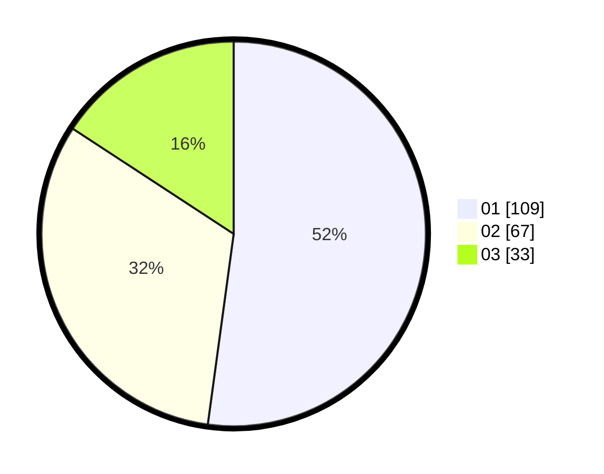

# Hasil

Hasil perolehan suara paslon dapat dilihat pada file paslon-01.txt, paslon-02.txt, dan paslon-03.txt.

Jika tidak ada, artinya data tersebut belum ada pada SIREKAP.

## Perolehan Suara

 * Paslon 01: **109**.
 * Paslon 02: **67**.
 * Paslon 03: **33**.

## Foto C Plano

https://sirekap-obj-formc.kpu.go.id/f588/pemilu/ppwp/31/71/07/10/06/3171071006014-20240216-152309--4212a177-0158-45a2-acde-fe218585b338.jpg

https://sirekap-obj-formc.kpu.go.id/f588/pemilu/ppwp/31/71/07/10/06/3171071006014-20240216-180406--80ff0c26-de28-4e8d-bc20-f3867cb6abc0.jpg

https://sirekap-obj-formc.kpu.go.id/f588/pemilu/ppwp/31/71/07/10/06/3171071006014-20240216-153349--60069d95-d9ba-4911-bf3e-b434fc46871a.jpg

## DATA PEMILIH TETAP

Jumlah pemilih dalam DPT: **258**.
 * L: **121**.
 * P: **137**.

## DATA PENGGUNA HAK PILIH

Jumlah pengguna hak pilih dalam DPT: **195**.
 * L: **89**.
 * P: **106**.

Jumlah pengguna hak pilih dalam DPTb: **14**.
 * L: **4**.
 * P: **10**.

Jumlah pengguna hak pilih dalam DPK: **2**.
 * L: **1**.
 * P: **1**.

Jumlah pengguna hak pilih: **211**.
 * L: **94**.
 * P: **117**.

## JUMLAH SUARA SAH DAN TIDAK SAH

JUMLAH SELURUH SUARA SAH: **209**.

JUMLAH SUARA TIDAK SAH: **2**.

JUMLAH SELURUH SUARA SAH DAN SUARA TIDAK SAH: **211**.
