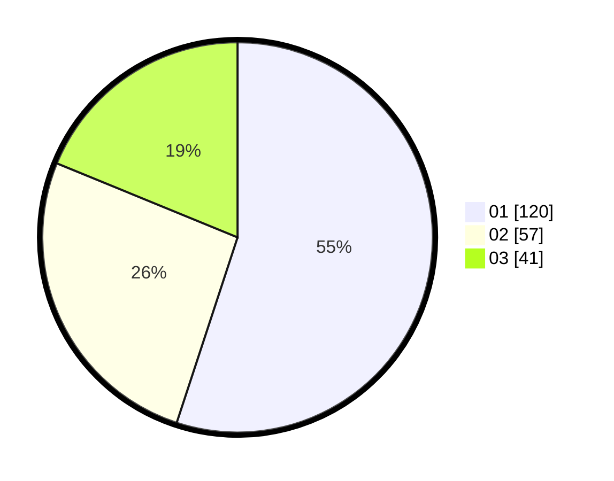

# Hasil

Hasil perolehan suara paslon dapat dilihat pada file paslon-01.txt, paslon-02.txt, dan paslon-03.txt.

Jika tidak ada, artinya data tersebut belum ada pada SIREKAP.

## Perolehan Suara

 * Paslon 01: **120**.
 * Paslon 02: **57**.
 * Paslon 03: **41**.

## Foto C Plano

https://sirekap-obj-formc.kpu.go.id/b862/pemilu/ppwp/31/71/07/10/06/3171071006019-20240214-203700--44cb744d-dcd1-4b54-a612-8ea114b14539.jpg

https://sirekap-obj-formc.kpu.go.id/b862/pemilu/ppwp/31/71/07/10/06/3171071006019-20240214-204006--ff2c20f1-d294-49b8-b7d2-7c9130f49741.jpg

https://sirekap-obj-formc.kpu.go.id/b862/pemilu/ppwp/31/71/07/10/06/3171071006019-20240214-204127--3f91eded-12bd-4030-85cd-ca63aa54c35e.jpg

## DATA PEMILIH TETAP

Jumlah pemilih dalam DPT: **284**.
 * L: **141**.
 * P: **143**.

## DATA PENGGUNA HAK PILIH

Jumlah pengguna hak pilih dalam DPT: **197**.
 * L: **98**.
 * P: **99**.

Jumlah pengguna hak pilih dalam DPTb: **23**.
 * L: **5**.
 * P: **18**.

Jumlah pengguna hak pilih dalam DPK: **0**.
 * L: **0**.
 * P: **0**.

Jumlah pengguna hak pilih: **220**.
 * L: **103**.
 * P: **117**.

## JUMLAH SUARA SAH DAN TIDAK SAH

JUMLAH SELURUH SUARA SAH: **218**.

JUMLAH SUARA TIDAK SAH: **2**.

JUMLAH SELURUH SUARA SAH DAN SUARA TIDAK SAH: **220**.
