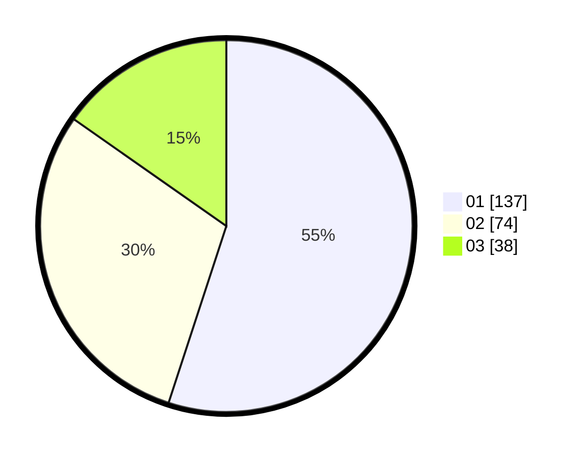

# Hasil

Hasil perolehan suara paslon dapat dilihat pada file paslon-01.txt, paslon-02.txt, dan paslon-03.txt.

Jika tidak ada, artinya data tersebut belum ada pada SIREKAP.

## Perolehan Suara

 * Paslon 01: **137**.
 * Paslon 02: **74**.
 * Paslon 03: **38**.

## Foto C Plano

https://sirekap-obj-formc.kpu.go.id/7bd9/pemilu/ppwp/31/71/07/10/06/3171071006020-20240215-023825--5bdc1e1d-9477-48a8-9d9c-8998e4bbbff9.jpg

https://sirekap-obj-formc.kpu.go.id/7bd9/pemilu/ppwp/31/71/07/10/06/3171071006020-20240215-023847--fcf34b21-9cd7-4db5-a636-3412fbe4afc2.jpg

https://sirekap-obj-formc.kpu.go.id/7bd9/pemilu/ppwp/31/71/07/10/06/3171071006020-20240215-023936--f41009ba-3521-4cb4-9aa7-44235f0a9890.jpg
