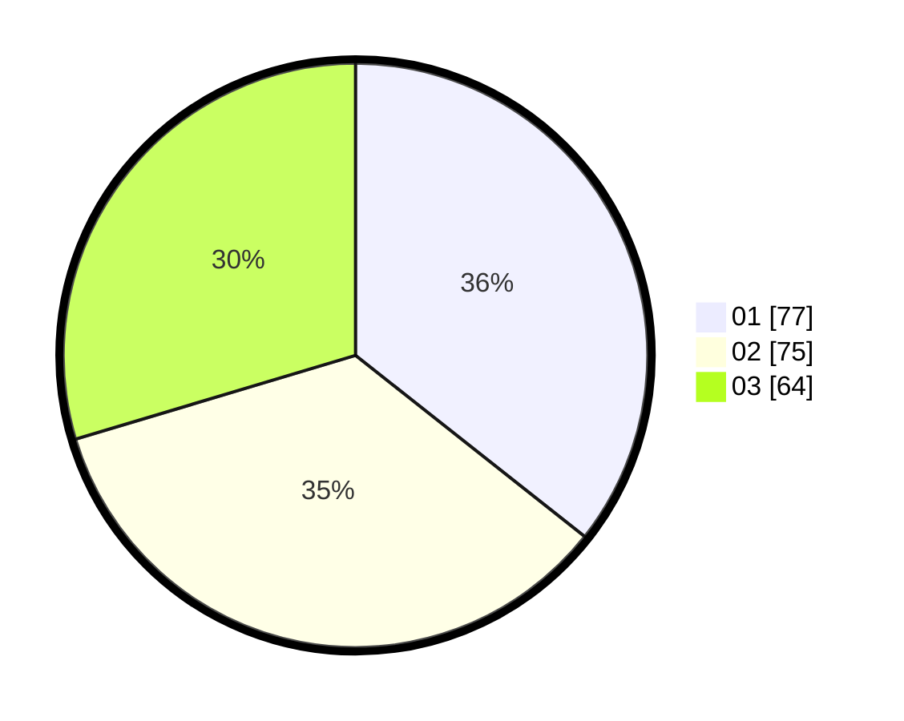

# Hasil

Hasil perolehan suara paslon dapat dilihat pada file paslon-01.txt, paslon-02.txt, dan paslon-03.txt.

Jika tidak ada, artinya data tersebut belum ada pada SIREKAP.

## Perolehan Suara

 * Paslon 01: **77**.
 * Paslon 02: **75**.
 * Paslon 03: **64**.

## Foto C Plano

https://sirekap-obj-formc.kpu.go.id/a05a/pemilu/ppwp/31/71/07/10/06/3171071006021-20240216-140351--f0685aad-71c9-45f3-ae5e-97964331929d.jpg

https://sirekap-obj-formc.kpu.go.id/a05a/pemilu/ppwp/31/71/07/10/06/3171071006021-20240216-140352--b01d0559-d5e0-4f2f-81b0-d574c602bb44.jpg

https://sirekap-obj-formc.kpu.go.id/a05a/pemilu/ppwp/31/71/07/10/06/3171071006021-20240216-140352--e5996123-2ee8-4de6-9cb2-556102a613a6.jpg

## DATA PEMILIH TETAP

Jumlah pemilih dalam DPT: **273**.
 * L: **132**.
 * P: **141**.

## DATA PENGGUNA HAK PILIH

Jumlah pengguna hak pilih dalam DPT: **193**.
 * L: **96**.
 * P: **97**.

Jumlah pengguna hak pilih dalam DPTb: **22**.
 * L: **7**.
 * P: **15**.

Jumlah pengguna hak pilih dalam DPK: **2**.
 * L: **1**.
 * P: **1**.

Jumlah pengguna hak pilih: **217**.
 * L: **104**.
 * P: **113**.

## JUMLAH SUARA SAH DAN TIDAK SAH

JUMLAH SELURUH SUARA SAH: **216**.

JUMLAH SUARA TIDAK SAH: **1**.

JUMLAH SELURUH SUARA SAH DAN SUARA TIDAK SAH: **217**.
