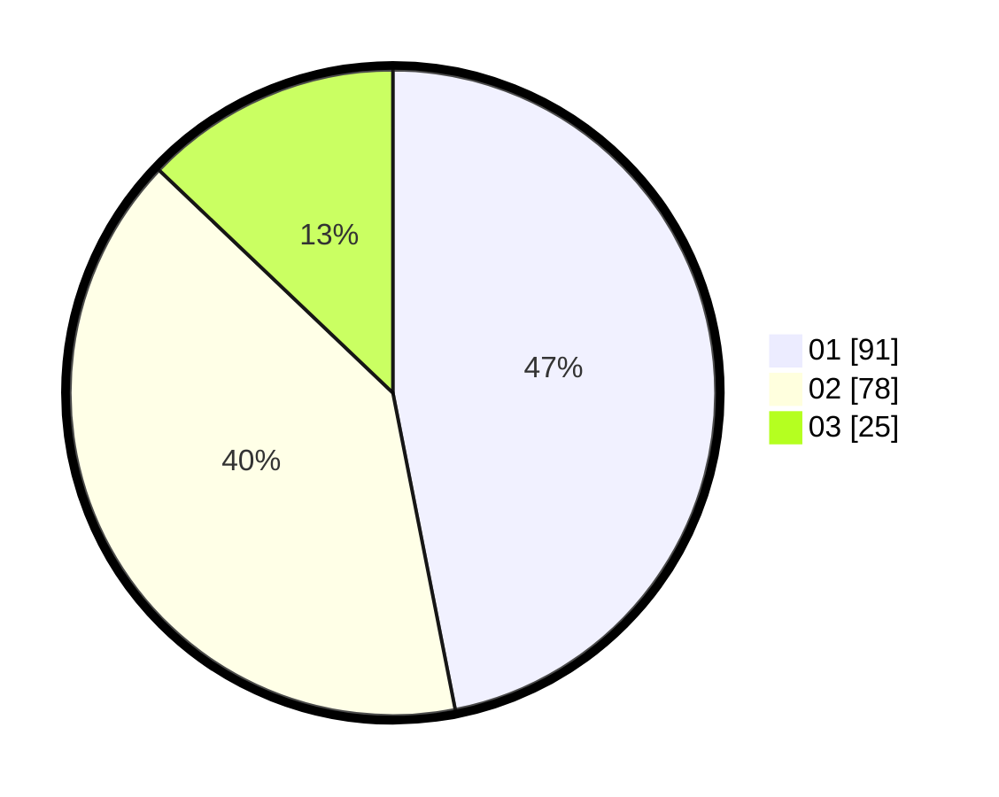

# Hasil

Hasil perolehan suara paslon dapat dilihat pada file paslon-01.txt, paslon-02.txt, dan paslon-03.txt.

Jika tidak ada, artinya data tersebut belum ada pada SIREKAP.

## Perolehan Suara

 * Paslon 01: **91**.
 * Paslon 02: **78**.
 * Paslon 03: **25**.

## Foto C Plano

https://sirekap-obj-formc.kpu.go.id/46d7/pemilu/ppwp/31/71/07/10/06/3171071006022-20240214-201541--f9d53e9f-daff-4f78-be56-84a693a7eba5.jpg

https://sirekap-obj-formc.kpu.go.id/46d7/pemilu/ppwp/31/71/07/10/06/3171071006022-20240216-170836--ed882af5-ae18-46dc-8a1b-3ba492ec7967.jpg

https://sirekap-obj-formc.kpu.go.id/46d7/pemilu/ppwp/31/71/07/10/06/3171071006022-20240214-202139--3c9e8d5d-f17d-4076-ac9b-53e589243398.jpg
