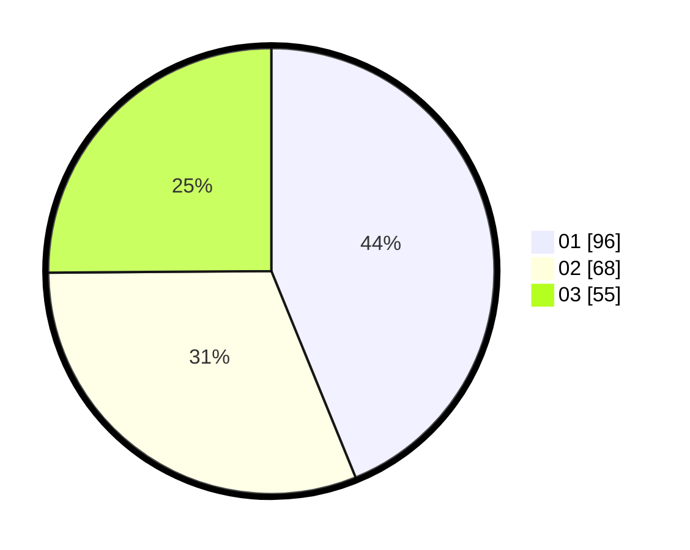

# Hasil

Hasil perolehan suara paslon dapat dilihat pada file paslon-01.txt, paslon-02.txt, dan paslon-03.txt.

Jika tidak ada, artinya data tersebut belum ada pada SIREKAP.

## Perolehan Suara

 * Paslon 01: **96**.
 * Paslon 02: **68**.
 * Paslon 03: **55**.

## Foto C Plano

https://sirekap-obj-formc.kpu.go.id/1b87/pemilu/ppwp/31/71/07/10/06/3171071006024-20240216-142108--99e6adf4-a596-4452-9f67-c22d989af533.jpg

https://sirekap-obj-formc.kpu.go.id/1b87/pemilu/ppwp/31/71/07/10/06/3171071006024-20240216-142110--1c0cfe3f-70b0-46ee-bc93-661b3424eed0.jpg

https://sirekap-obj-formc.kpu.go.id/1b87/pemilu/ppwp/31/71/07/10/06/3171071006024-20240216-142109--d79275d9-74f9-4077-9596-834722a6d9e4.jpg

## DATA PEMILIH TETAP

Jumlah pemilih dalam DPT: **268**.
 * L: **130**.
 * P: **138**.

## DATA PENGGUNA HAK PILIH

Jumlah pengguna hak pilih dalam DPT: **197**.
 * L: **93**.
 * P: **104**.

Jumlah pengguna hak pilih dalam DPTb: **20**.
 * L: **4**.
 * P: **16**.

Jumlah pengguna hak pilih dalam DPK: **2**.
 * L: **0**.
 * P: **2**.

Jumlah pengguna hak pilih: **219**.
 * L: **97**.
 * P: **122**.

## JUMLAH SUARA SAH DAN TIDAK SAH

JUMLAH SELURUH SUARA SAH: **219**.

JUMLAH SUARA TIDAK SAH: **0**.

JUMLAH SELURUH SUARA SAH DAN SUARA TIDAK SAH: **219**.
