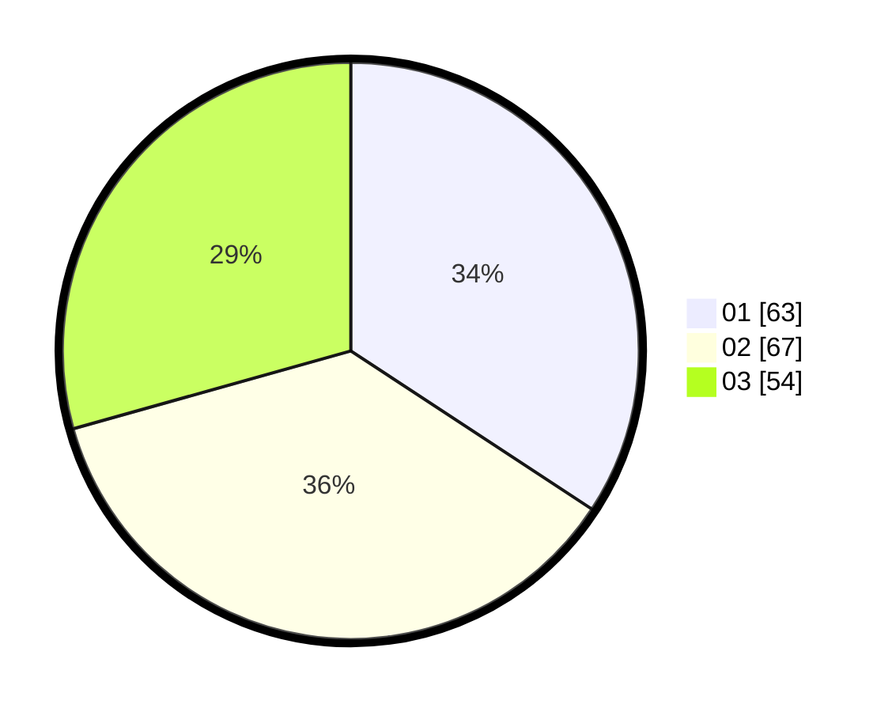

# Hasil

Hasil perolehan suara paslon dapat dilihat pada file paslon-01.txt, paslon-02.txt, dan paslon-03.txt.

Jika tidak ada, artinya data tersebut belum ada pada SIREKAP.

## Perolehan Suara

 * Paslon 01: **63**.
 * Paslon 02: **67**.
 * Paslon 03: **54**.

## Foto C Plano

https://sirekap-obj-formc.kpu.go.id/c2e9/pemilu/ppwp/31/71/07/10/06/3171071006025-20240214-155517--08eb76cb-c448-494a-b674-6c1db01a6bdc.jpg

https://sirekap-obj-formc.kpu.go.id/c2e9/pemilu/ppwp/31/71/07/10/06/3171071006025-20240214-155734--9fdf9253-097a-4811-87b0-97caa2c48031.jpg

https://sirekap-obj-formc.kpu.go.id/c2e9/pemilu/ppwp/31/71/07/10/06/3171071006025-20240214-160106--de6c8689-b8a4-495f-8ac3-24ca0487f942.jpg
