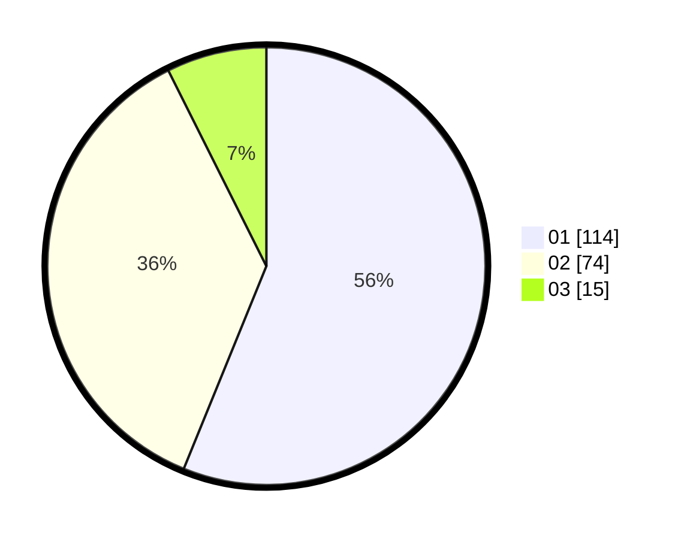

# Hasil

Hasil perolehan suara paslon dapat dilihat pada file paslon-01.txt, paslon-02.txt, dan paslon-03.txt.

Jika tidak ada, artinya data tersebut belum ada pada SIREKAP.

## Perolehan Suara

 * Paslon 01: **114**.
 * Paslon 02: **74**.
 * Paslon 03: **15**.

## Foto C Plano

https://sirekap-obj-formc.kpu.go.id/3c20/pemilu/ppwp/31/71/07/10/06/3171071006028-20240214-194245--3a83e1ee-1461-4ab3-af8a-7152f6c787f3.jpg

https://sirekap-obj-formc.kpu.go.id/3c20/pemilu/ppwp/31/71/07/10/06/3171071006028-20240214-214647--bafb8590-3e4b-4c59-a71c-dd60794a4842.jpg

https://sirekap-obj-formc.kpu.go.id/3c20/pemilu/ppwp/31/71/07/10/06/3171071006028-20240214-210651--450ad164-cff2-4fbe-bb88-1f03dc1aeef8.jpg

## DATA PEMILIH TETAP

Jumlah pemilih dalam DPT: **244**.
 * L: **121**.
 * P: **123**.

## DATA PENGGUNA HAK PILIH

Jumlah pengguna hak pilih dalam DPT: **190**.
 * L: **85**.
 * P: **105**.

Jumlah pengguna hak pilih dalam DPTb: **13**.
 * L: **6**.
 * P: **7**.

Jumlah pengguna hak pilih dalam DPK: **0**.
 * L: **0**.
 * P: **0**.

Jumlah pengguna hak pilih: **203**.
 * L: **91**.
 * P: **112**.

## JUMLAH SUARA SAH DAN TIDAK SAH

JUMLAH SELURUH SUARA SAH: **203**.

JUMLAH SUARA TIDAK SAH: **0**.

JUMLAH SELURUH SUARA SAH DAN SUARA TIDAK SAH: **203**.
