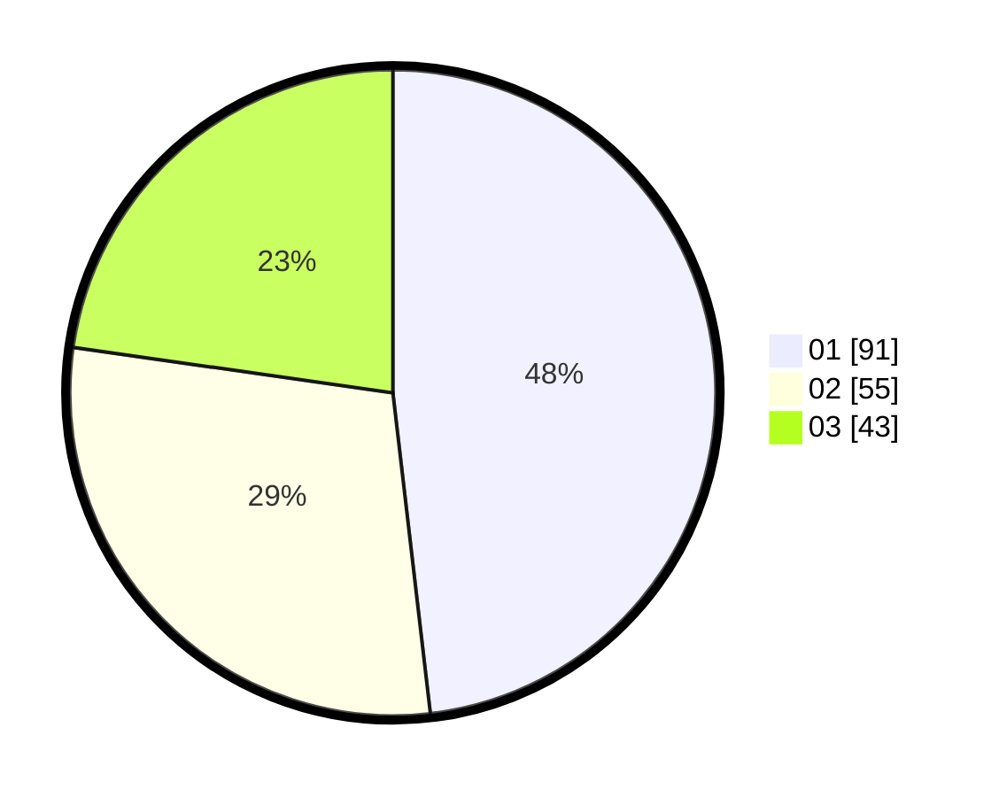

# Hasil

Hasil perolehan suara paslon dapat dilihat pada file paslon-01.txt, paslon-02.txt, dan paslon-03.txt.

Jika tidak ada, artinya data tersebut belum ada pada SIREKAP.

## Perolehan Suara

 * Paslon 01: **91**.
 * Paslon 02: **55**.
 * Paslon 03: **43**.

## Foto C Plano

https://sirekap-obj-formc.kpu.go.id/7252/pemilu/ppwp/31/71/07/10/06/3171071006029-20240215-211039--1675d08c-6ff4-42a4-9a6f-97d94a21c894.jpg

https://sirekap-obj-formc.kpu.go.id/7252/pemilu/ppwp/31/71/07/10/06/3171071006029-20240215-211041--e8502d9e-0b3f-450f-84eb-ff31735b5f03.jpg

https://sirekap-obj-formc.kpu.go.id/7252/pemilu/ppwp/31/71/07/10/06/3171071006029-20240215-211040--a31ac4c9-d6fd-405d-b786-f7b2e5b3f6f2.jpg

## DATA PEMILIH TETAP

Jumlah pemilih dalam DPT: **248**.
 * L: **126**.
 * P: **122**.

## DATA PENGGUNA HAK PILIH

Jumlah pengguna hak pilih dalam DPT: **172**.
 * L: **92**.
 * P: **80**.

Jumlah pengguna hak pilih dalam DPTb: **15**.
 * L: **6**.
 * P: **9**.

Jumlah pengguna hak pilih dalam DPK: **4**.
 * L: **1**.
 * P: **3**.

Jumlah pengguna hak pilih: **191**.
 * L: **99**.
 * P: **92**.

## JUMLAH SUARA SAH DAN TIDAK SAH

JUMLAH SELURUH SUARA SAH: **189**.

JUMLAH SUARA TIDAK SAH: **2**.

JUMLAH SELURUH SUARA SAH DAN SUARA TIDAK SAH: **191**.
