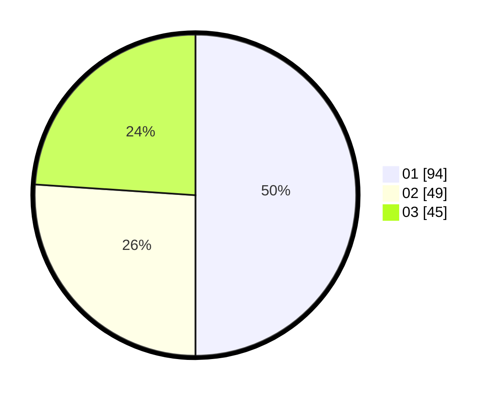

# Hasil

Hasil perolehan suara paslon dapat dilihat pada file paslon-01.txt, paslon-02.txt, dan paslon-03.txt.

Jika tidak ada, artinya data tersebut belum ada pada SIREKAP.

## Perolehan Suara

 * Paslon 01: **94**.
 * Paslon 02: **49**.
 * Paslon 03: **45**.

## Foto C Plano

https://sirekap-obj-formc.kpu.go.id/c3cc/pemilu/ppwp/31/71/07/10/06/3171071006030-20240216-231509--611f3f76-129b-46ad-bc6c-1056f4864561.jpg

https://sirekap-obj-formc.kpu.go.id/c3cc/pemilu/ppwp/31/71/07/10/06/3171071006030-20240216-231511--4148cc23-5228-4607-9281-0d9eeb56eaed.jpg

https://sirekap-obj-formc.kpu.go.id/c3cc/pemilu/ppwp/31/71/07/10/06/3171071006030-20240216-231510--33bec075-1496-4e66-9fd0-547886ca0148.jpg

## DATA PEMILIH TETAP

Jumlah pemilih dalam DPT: **251**.
 * L: **118**.
 * P: **133**.

## DATA PENGGUNA HAK PILIH

Jumlah pengguna hak pilih dalam DPT: **181**.
 * L: **80**.
 * P: **101**.

Jumlah pengguna hak pilih dalam DPTb: **7**.
 * L: **2**.
 * P: **5**.

Jumlah pengguna hak pilih dalam DPK: **2**.
 * L: **0**.
 * P: **2**.

Jumlah pengguna hak pilih: **190**.
 * L: **82**.
 * P: **108**.

## JUMLAH SUARA SAH DAN TIDAK SAH

JUMLAH SELURUH SUARA SAH: **188**.

JUMLAH SUARA TIDAK SAH: **1**.

JUMLAH SELURUH SUARA SAH DAN SUARA TIDAK SAH: **189**.
