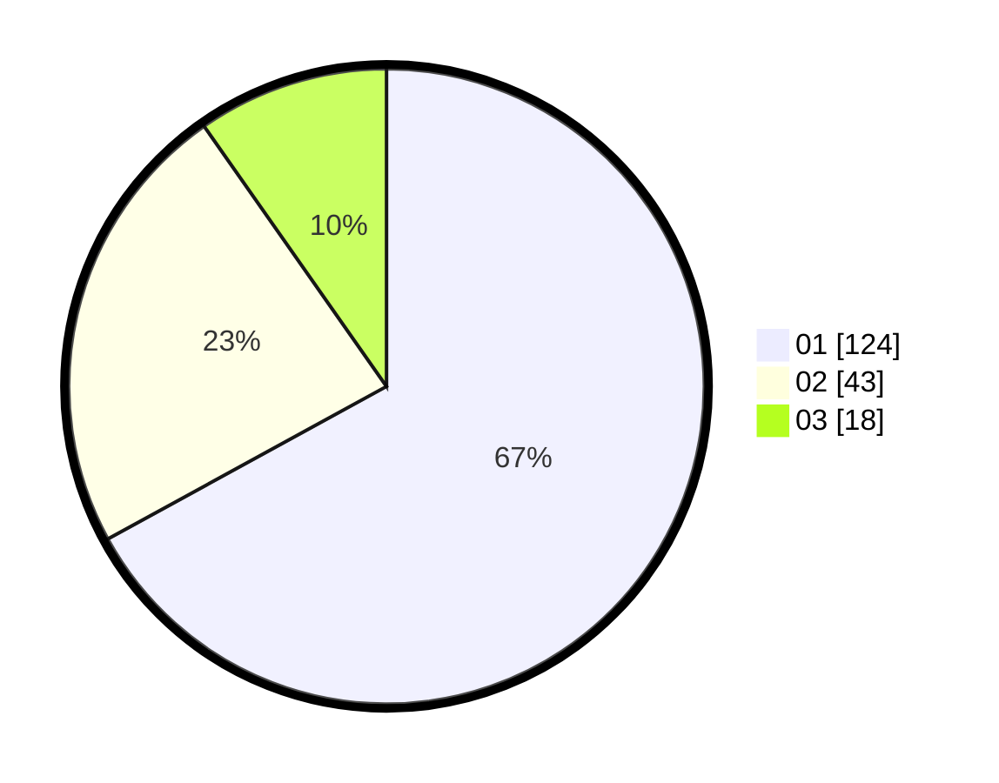

# Hasil

Hasil perolehan suara paslon dapat dilihat pada file paslon-01.txt, paslon-02.txt, dan paslon-03.txt.

Jika tidak ada, artinya data tersebut belum ada pada SIREKAP.

## Perolehan Suara

 * Paslon 01: **124**.
 * Paslon 02: **43**.
 * Paslon 03: **18**.

## Foto C Plano

https://sirekap-obj-formc.kpu.go.id/8657/pemilu/ppwp/31/71/07/10/06/3171071006031-20240216-024401--fc8a1859-7fc9-433b-8e81-c8e65623cb05.jpg

https://sirekap-obj-formc.kpu.go.id/8657/pemilu/ppwp/31/71/07/10/06/3171071006031-20240216-024403--59398be2-66d5-41c8-a5b8-654f213088c2.jpg

https://sirekap-obj-formc.kpu.go.id/8657/pemilu/ppwp/31/71/07/10/06/3171071006031-20240216-024402--05d8a2d5-a87b-431c-b5cd-3719d011d76c.jpg

## DATA PEMILIH TETAP

Jumlah pemilih dalam DPT: **243**.
 * L: **121**.
 * P: **122**.

## DATA PENGGUNA HAK PILIH

Jumlah pengguna hak pilih dalam DPT: **178**.
 * L: **87**.
 * P: **91**.

Jumlah pengguna hak pilih dalam DPTb: **12**.
 * L: **2**.
 * P: **10**.

Jumlah pengguna hak pilih dalam DPK: **0**.
 * L: **0**.
 * P: **0**.

Jumlah pengguna hak pilih: **190**.
 * L: **89**.
 * P: **101**.

## JUMLAH SUARA SAH DAN TIDAK SAH

JUMLAH SELURUH SUARA SAH: **185**.

JUMLAH SUARA TIDAK SAH: **5**.

JUMLAH SELURUH SUARA SAH DAN SUARA TIDAK SAH: **190**.
