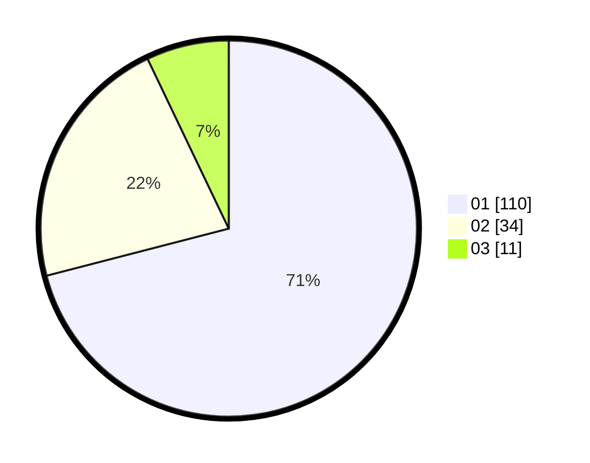

# Hasil

Hasil perolehan suara paslon dapat dilihat pada file paslon-01.txt, paslon-02.txt, dan paslon-03.txt.

Jika tidak ada, artinya data tersebut belum ada pada SIREKAP.

## Perolehan Suara

 * Paslon 01: **110**.
 * Paslon 02: **34**.
 * Paslon 03: **11**.

## Foto C Plano

https://sirekap-obj-formc.kpu.go.id/901d/pemilu/ppwp/31/71/07/10/06/3171071006038-20240214-214904--487bc59c-7d78-4023-9eaa-1c31b7a08694.jpg

https://sirekap-obj-formc.kpu.go.id/901d/pemilu/ppwp/31/71/07/10/06/3171071006038-20240214-214508--1ed95159-1f9d-4d8d-8743-3a4ea55ec552.jpg

https://sirekap-obj-formc.kpu.go.id/901d/pemilu/ppwp/31/71/07/10/06/3171071006038-20240214-233059--f763c970-45a1-4bfe-93ee-fcaf173d07dd.jpg
