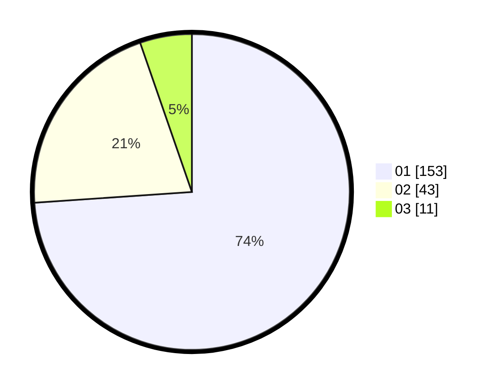

# Hasil

Hasil perolehan suara paslon dapat dilihat pada file paslon-01.txt, paslon-02.txt, dan paslon-03.txt.

Jika tidak ada, artinya data tersebut belum ada pada SIREKAP.

## Perolehan Suara

 * Paslon 01: **153**.
 * Paslon 02: **43**.
 * Paslon 03: **11**.

## Foto C Plano

https://sirekap-obj-formc.kpu.go.id/0147/pemilu/ppwp/31/71/07/10/06/3171071006042-20240216-234257--13eccbda-c675-4e1f-8ce6-d0fbe091109d.jpg

https://sirekap-obj-formc.kpu.go.id/0147/pemilu/ppwp/31/71/07/10/06/3171071006042-20240216-170047--c6641235-feaa-4e6f-bba3-df26fccbbf9c.jpg

https://sirekap-obj-formc.kpu.go.id/0147/pemilu/ppwp/31/71/07/10/06/3171071006042-20240216-170046--9669c943-b5bd-47fd-85a2-0225bbda768e.jpg

## DATA PEMILIH TETAP

Jumlah pemilih dalam DPT: **258**.
 * L: **129**.
 * P: **129**.

## DATA PENGGUNA HAK PILIH

Jumlah pengguna hak pilih dalam DPT: **203**.
 * L: **103**.
 * P: **100**.

Jumlah pengguna hak pilih dalam DPTb: **2**.
 * L: **1**.
 * P: **1**.

Jumlah pengguna hak pilih dalam DPK: **2**.
 * L: **2**.
 * P: **0**.

Jumlah pengguna hak pilih: **207**.
 * L: **106**.
 * P: **101**.

## JUMLAH SUARA SAH DAN TIDAK SAH

JUMLAH SELURUH SUARA SAH: **207**.

JUMLAH SUARA TIDAK SAH: **0**.

JUMLAH SELURUH SUARA SAH DAN SUARA TIDAK SAH: **207**.
