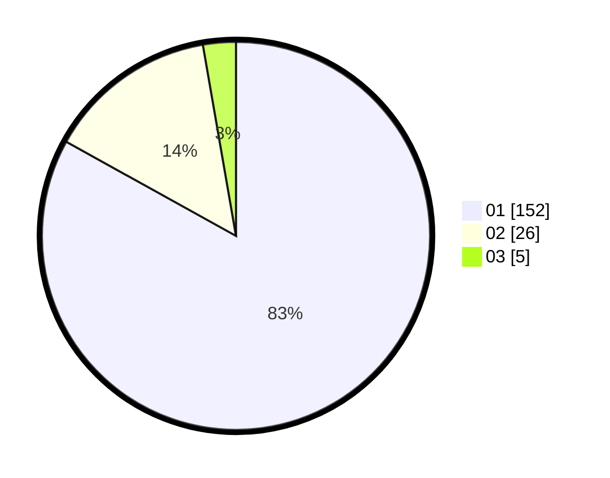

# Hasil

Hasil perolehan suara paslon dapat dilihat pada file paslon-01.txt, paslon-02.txt, dan paslon-03.txt.

Jika tidak ada, artinya data tersebut belum ada pada SIREKAP.

## Perolehan Suara

 * Paslon 01: **152**.
 * Paslon 02: **26**.
 * Paslon 03: **5**.

## Foto C Plano

https://sirekap-obj-formc.kpu.go.id/5e37/pemilu/ppwp/31/71/07/10/06/3171071006044-20240214-191402--a8d99fe7-9e6d-4cc6-93ed-831d726a20a1.jpg

https://sirekap-obj-formc.kpu.go.id/5e37/pemilu/ppwp/31/71/07/10/06/3171071006044-20240214-191428--67dc0dce-b0a0-461c-93e0-53d94db81cf6.jpg

https://sirekap-obj-formc.kpu.go.id/5e37/pemilu/ppwp/31/71/07/10/06/3171071006044-20240214-191447--c84e9c74-e1db-461b-afa2-c558e32e256f.jpg

## DATA PEMILIH TETAP

Jumlah pemilih dalam DPT: **221**.
 * L: **110**.
 * P: **111**.

## DATA PENGGUNA HAK PILIH

Jumlah pengguna hak pilih dalam DPT: **182**.
 * L: **88**.
 * P: **94**.

Jumlah pengguna hak pilih dalam DPTb: **0**.
 * L: **0**.
 * P: **0**.

Jumlah pengguna hak pilih dalam DPK: **3**.
 * L: **1**.
 * P: **2**.

Jumlah pengguna hak pilih: **185**.
 * L: **89**.
 * P: **96**.

## JUMLAH SUARA SAH DAN TIDAK SAH

JUMLAH SELURUH SUARA SAH: **183**.

JUMLAH SUARA TIDAK SAH: **2**.

JUMLAH SELURUH SUARA SAH DAN SUARA TIDAK SAH: **185**.
