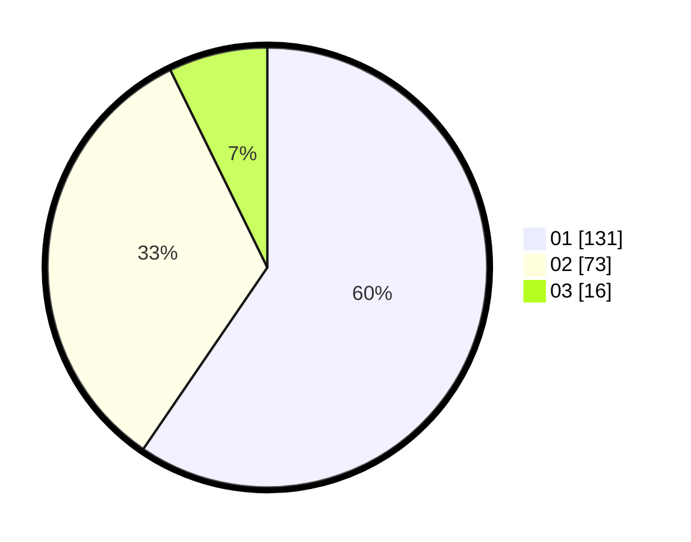

# Hasil

Hasil perolehan suara paslon dapat dilihat pada file paslon-01.txt, paslon-02.txt, dan paslon-03.txt.

Jika tidak ada, artinya data tersebut belum ada pada SIREKAP.

## Perolehan Suara

 * Paslon 01: **131**.
 * Paslon 02: **73**.
 * Paslon 03: **16**.

## Foto C Plano

https://sirekap-obj-formc.kpu.go.id/f445/pemilu/ppwp/31/71/07/10/06/3171071006049-20240214-195940--d92f1bf4-176c-4f3c-851f-43c48c5a3000.jpg

https://sirekap-obj-formc.kpu.go.id/f445/pemilu/ppwp/31/71/07/10/06/3171071006049-20240214-200110--7bb9ee97-3504-4946-88bf-e86b29af8ea2.jpg

https://sirekap-obj-formc.kpu.go.id/f445/pemilu/ppwp/31/71/07/10/06/3171071006049-20240214-200211--fe436aa6-73bf-45e9-8423-5a6d89f285f2.jpg

## DATA PEMILIH TETAP

Jumlah pemilih dalam DPT: **274**.
 * L: **143**.
 * P: **131**.

## DATA PENGGUNA HAK PILIH

Jumlah pengguna hak pilih dalam DPT: **212**.
 * L: **108**.
 * P: **104**.

Jumlah pengguna hak pilih dalam DPTb: **5**.
 * L: **2**.
 * P: **3**.

Jumlah pengguna hak pilih dalam DPK: **4**.
 * L: **2**.
 * P: **2**.

Jumlah pengguna hak pilih: **221**.
 * L: **112**.
 * P: **109**.

## JUMLAH SUARA SAH DAN TIDAK SAH

JUMLAH SELURUH SUARA SAH: **220**.

JUMLAH SUARA TIDAK SAH: **1**.

JUMLAH SELURUH SUARA SAH DAN SUARA TIDAK SAH: **221**.
