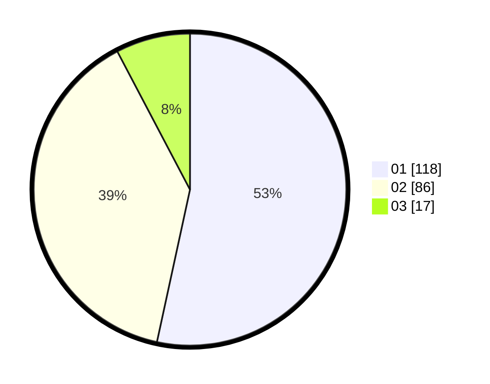

# Hasil

Hasil perolehan suara paslon dapat dilihat pada file paslon-01.txt, paslon-02.txt, dan paslon-03.txt.

Jika tidak ada, artinya data tersebut belum ada pada SIREKAP.

## Perolehan Suara

 * Paslon 01: **118**.
 * Paslon 02: **86**.
 * Paslon 03: **17**.

## Foto C Plano

https://sirekap-obj-formc.kpu.go.id/fc34/pemilu/ppwp/31/71/07/10/06/3171071006051-20240216-153315--0b31e8f0-997b-4580-a93f-a5011eaf6942.jpg

https://sirekap-obj-formc.kpu.go.id/fc34/pemilu/ppwp/31/71/07/10/06/3171071006051-20240216-153317--8e785133-dfe3-4cdb-bf0b-d828ef0c3fc5.jpg

https://sirekap-obj-formc.kpu.go.id/fc34/pemilu/ppwp/31/71/07/10/06/3171071006051-20240216-153316--607e9984-c464-4759-9f54-64ce3d71f105.jpg

## DATA PEMILIH TETAP

Jumlah pemilih dalam DPT: **284**.
 * L: **150**.
 * P: **134**.

## DATA PENGGUNA HAK PILIH

Jumlah pengguna hak pilih dalam DPT: **217**.
 * L: **110**.
 * P: **107**.

Jumlah pengguna hak pilih dalam DPTb: **8**.
 * L: **2**.
 * P: **6**.

Jumlah pengguna hak pilih dalam DPK: **0**.
 * L: **0**.
 * P: **0**.

Jumlah pengguna hak pilih: **225**.
 * L: **112**.
 * P: **113**.

## JUMLAH SUARA SAH DAN TIDAK SAH

JUMLAH SELURUH SUARA SAH: **221**.

JUMLAH SUARA TIDAK SAH: **4**.

JUMLAH SELURUH SUARA SAH DAN SUARA TIDAK SAH: **225**.
