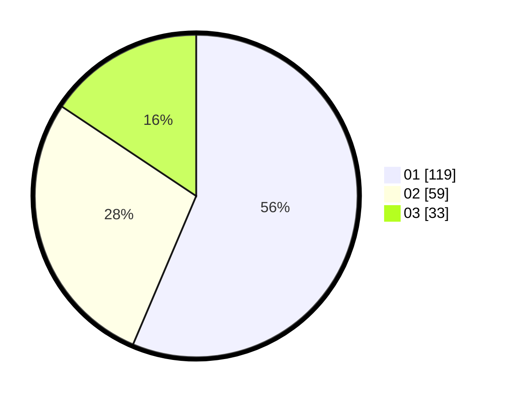

# Hasil

Hasil perolehan suara paslon dapat dilihat pada file paslon-01.txt, paslon-02.txt, dan paslon-03.txt.

Jika tidak ada, artinya data tersebut belum ada pada SIREKAP.

## Perolehan Suara

 * Paslon 01: **119**.
 * Paslon 02: **59**.
 * Paslon 03: **33**.

## Foto C Plano

https://sirekap-obj-formc.kpu.go.id/70d9/pemilu/ppwp/31/71/07/10/06/3171071006054-20240216-142207--fb4fc698-db1a-4f45-820f-d5b101605c62.jpg

https://sirekap-obj-formc.kpu.go.id/70d9/pemilu/ppwp/31/71/07/10/06/3171071006054-20240216-091340--b161d0a0-e25a-44f9-bf08-9cdd54549e93.jpg

https://sirekap-obj-formc.kpu.go.id/70d9/pemilu/ppwp/31/71/07/10/06/3171071006054-20240216-091337--bdfdec02-b74e-41f2-8643-82020e4e6913.jpg

## DATA PEMILIH TETAP

Jumlah pemilih dalam DPT: **273**.
 * L: **137**.
 * P: **136**.

## DATA PENGGUNA HAK PILIH

Jumlah pengguna hak pilih dalam DPT: **199**.
 * L: **99**.
 * P: **100**.

Jumlah pengguna hak pilih dalam DPTb: **14**.
 * L: **8**.
 * P: **6**.

Jumlah pengguna hak pilih dalam DPK: **0**.
 * L: **0**.
 * P: **0**.

Jumlah pengguna hak pilih: **213**.
 * L: **107**.
 * P: **106**.

## JUMLAH SUARA SAH DAN TIDAK SAH

JUMLAH SELURUH SUARA SAH: **211**.

JUMLAH SUARA TIDAK SAH: **2**.

JUMLAH SELURUH SUARA SAH DAN SUARA TIDAK SAH: **213**.
