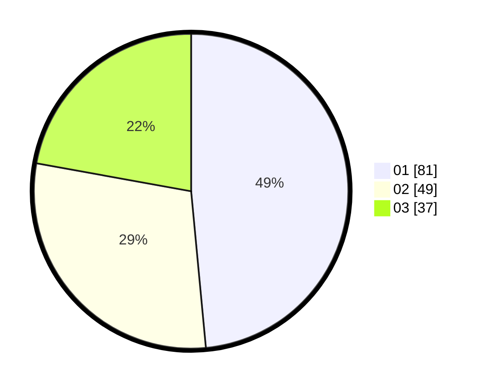

# Hasil

Hasil perolehan suara paslon dapat dilihat pada file paslon-01.txt, paslon-02.txt, dan paslon-03.txt.

Jika tidak ada, artinya data tersebut belum ada pada SIREKAP.

## Perolehan Suara

 * Paslon 01: **81**.
 * Paslon 02: **49**.
 * Paslon 03: **37**.

## Foto C Plano

https://sirekap-obj-formc.kpu.go.id/355b/pemilu/ppwp/31/71/07/10/06/3171071006055-20240214-155613--242f5efe-0816-457e-befd-739dc08b1139.jpg

https://sirekap-obj-formc.kpu.go.id/355b/pemilu/ppwp/31/71/07/10/06/3171071006055-20240214-155831--c081a0bc-63b6-4f45-bf62-26c0431617fc.jpg

https://sirekap-obj-formc.kpu.go.id/355b/pemilu/ppwp/31/71/07/10/06/3171071006055-20240214-160119--c7674513-a9c5-4105-a5f0-633107f04c22.jpg
