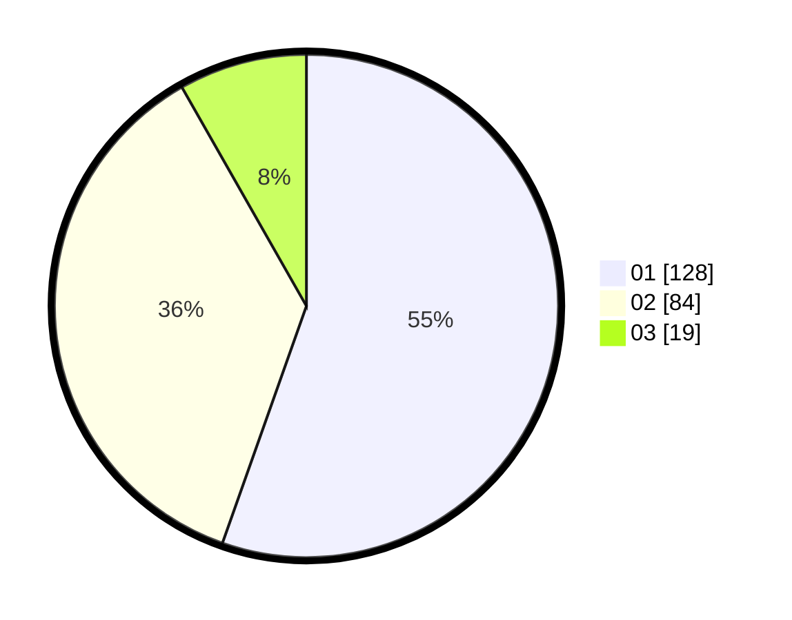

# Hasil

Hasil perolehan suara paslon dapat dilihat pada file paslon-01.txt, paslon-02.txt, dan paslon-03.txt.

Jika tidak ada, artinya data tersebut belum ada pada SIREKAP.

## Perolehan Suara

 * Paslon 01: **128**.
 * Paslon 02: **84**.
 * Paslon 03: **19**.

## Foto C Plano

https://sirekap-obj-formc.kpu.go.id/e087/pemilu/ppwp/31/71/07/10/06/3171071006064-20240214-231508--bb148b72-0433-455b-bd01-ed85fcc8a324.jpg

https://sirekap-obj-formc.kpu.go.id/e087/pemilu/ppwp/31/71/07/10/06/3171071006064-20240214-194545--d4d63823-3515-45b1-97a5-d37370b8b49f.jpg

https://sirekap-obj-formc.kpu.go.id/e087/pemilu/ppwp/31/71/07/10/06/3171071006064-20240214-194434--12a2a45e-e099-4b30-bd55-45f67369a32a.jpg
