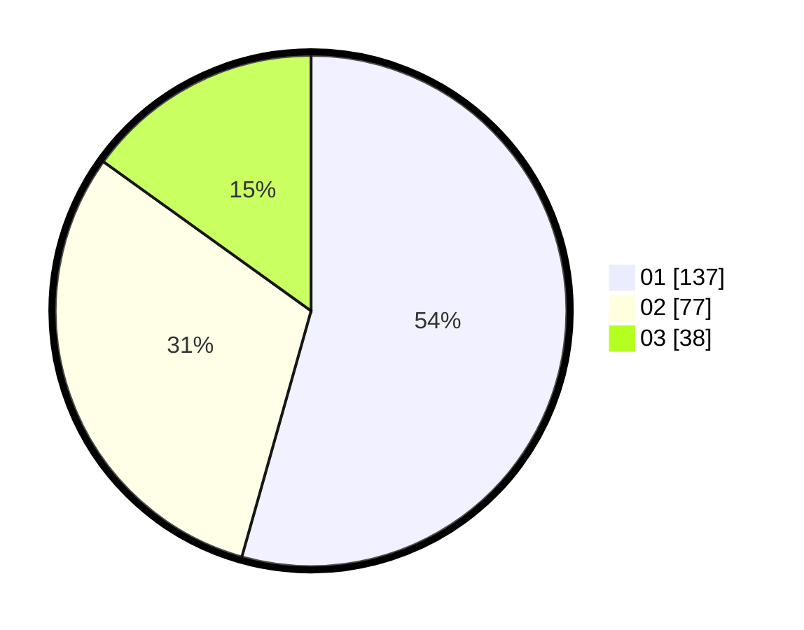

# Hasil

Hasil perolehan suara paslon dapat dilihat pada file paslon-01.txt, paslon-02.txt, dan paslon-03.txt.

Jika tidak ada, artinya data tersebut belum ada pada SIREKAP.

## Perolehan Suara

 * Paslon 01: **137**.
 * Paslon 02: **77**.
 * Paslon 03: **38**.

## Foto C Plano

https://sirekap-obj-formc.kpu.go.id/4587/pemilu/ppwp/31/71/07/10/06/3171071006070-20240216-190417--97c381a5-bc01-4568-85c6-13ca557a5ae5.jpg

https://sirekap-obj-formc.kpu.go.id/4587/pemilu/ppwp/31/71/07/10/06/3171071006070-20240216-190420--7440c39a-a5b9-422b-ad90-1c2c8b4b251b.jpg

https://sirekap-obj-formc.kpu.go.id/4587/pemilu/ppwp/31/71/07/10/06/3171071006070-20240216-190419--19066342-c4d0-4379-8fb0-8b030f543aa0.jpg

## DATA PEMILIH TETAP

Jumlah pemilih dalam DPT: **293**.
 * L: **141**.
 * P: **152**.

## DATA PENGGUNA HAK PILIH

Jumlah pengguna hak pilih dalam DPT: **225**.
 * L: **110**.
 * P: **115**.

Jumlah pengguna hak pilih dalam DPTb: **23**.
 * L: **9**.
 * P: **14**.

Jumlah pengguna hak pilih dalam DPK: **8**.
 * L: **4**.
 * P: **4**.

Jumlah pengguna hak pilih: **256**.
 * L: **123**.
 * P: **133**.

## JUMLAH SUARA SAH DAN TIDAK SAH

JUMLAH SELURUH SUARA SAH: **252**.

JUMLAH SUARA TIDAK SAH: **4**.

JUMLAH SELURUH SUARA SAH DAN SUARA TIDAK SAH: **256**.
