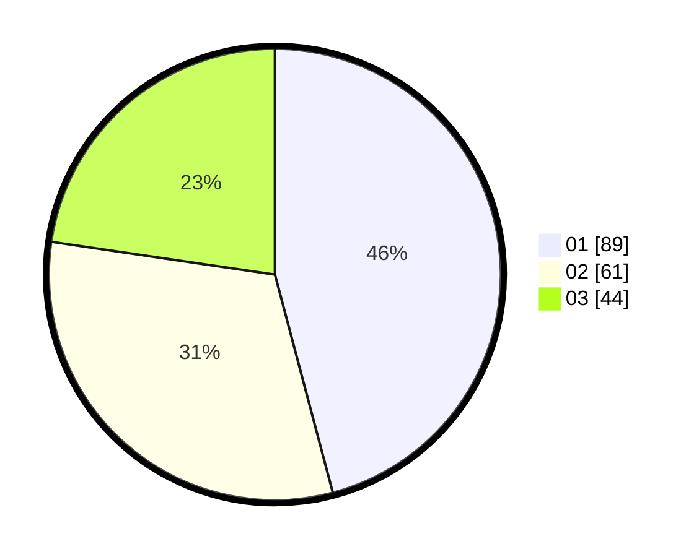

# Hasil

Hasil perolehan suara paslon dapat dilihat pada file paslon-01.txt, paslon-02.txt, dan paslon-03.txt.

Jika tidak ada, artinya data tersebut belum ada pada SIREKAP.

## Perolehan Suara

 * Paslon 01: **89**.
 * Paslon 02: **61**.
 * Paslon 03: **44**.

## Foto C Plano

https://sirekap-obj-formc.kpu.go.id/b253/pemilu/ppwp/31/71/07/10/06/3171071006075-20240214-230557--1b5e10b6-4ded-43f4-bb67-18678ffef2d0.jpg

https://sirekap-obj-formc.kpu.go.id/b253/pemilu/ppwp/31/71/07/10/06/3171071006075-20240214-231326--903cb757-6622-48ee-99a6-177f1b3b17c6.jpg

https://sirekap-obj-formc.kpu.go.id/b253/pemilu/ppwp/31/71/07/10/06/3171071006075-20240214-230736--c98df0f2-1ce0-4104-a112-da9621f0dfde.jpg
