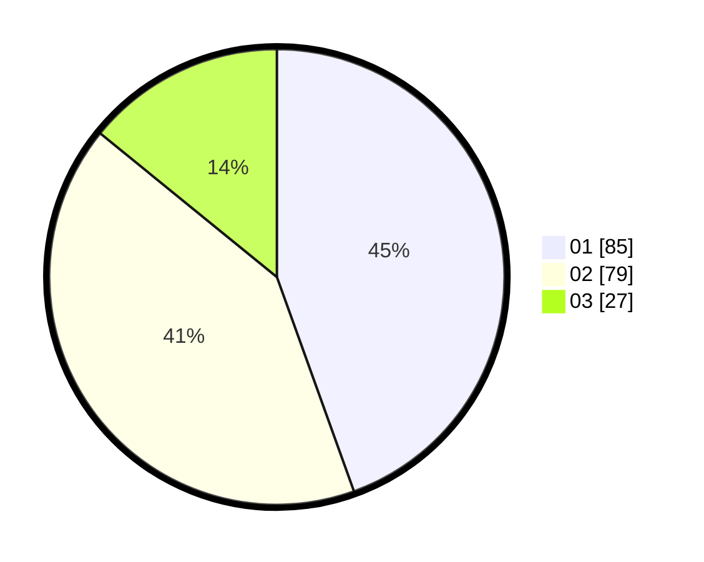

# Hasil

Hasil perolehan suara paslon dapat dilihat pada file paslon-01.txt, paslon-02.txt, dan paslon-03.txt.

Jika tidak ada, artinya data tersebut belum ada pada SIREKAP.

## Perolehan Suara

 * Paslon 01: **85**.
 * Paslon 02: **79**.
 * Paslon 03: **27**.

## Foto C Plano

https://sirekap-obj-formc.kpu.go.id/12d3/pemilu/ppwp/31/71/07/10/07/3171071007002-20240216-173153--2385c279-ee16-4c8d-91e9-62fc0adf7bf6.jpg

https://sirekap-obj-formc.kpu.go.id/12d3/pemilu/ppwp/31/71/07/10/07/3171071007002-20240216-162601--929841e7-811d-44e7-8e56-e21d9115bec3.jpg
