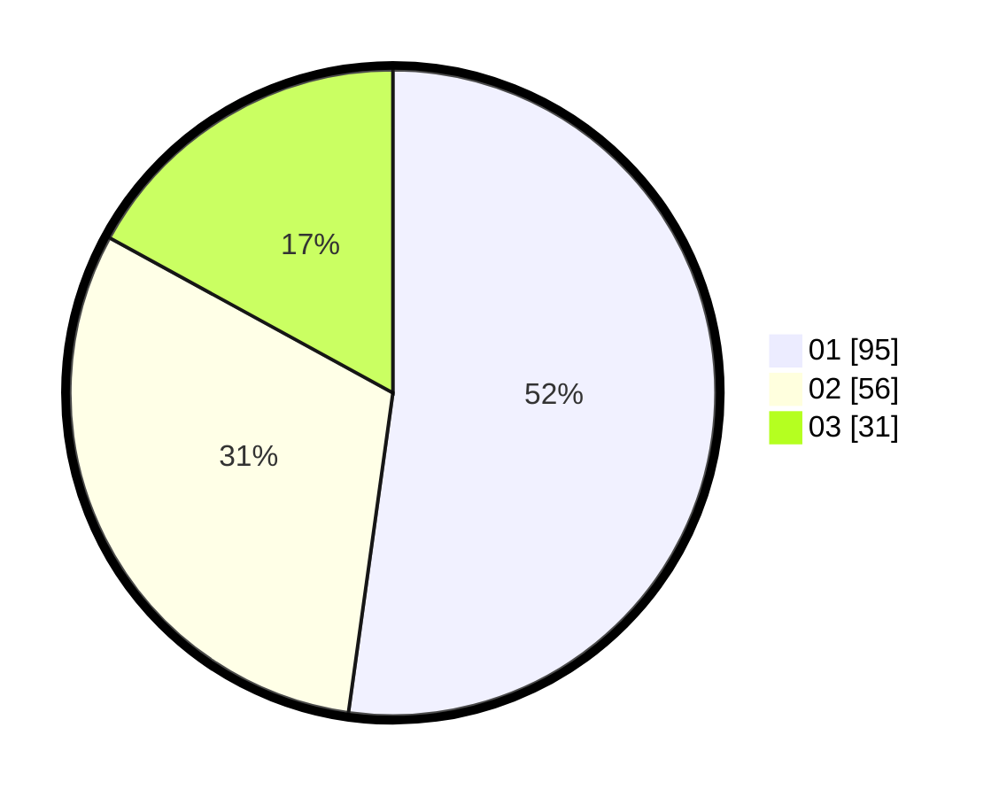

# Hasil

Hasil perolehan suara paslon dapat dilihat pada file paslon-01.txt, paslon-02.txt, dan paslon-03.txt.

Jika tidak ada, artinya data tersebut belum ada pada SIREKAP.

## Perolehan Suara

 * Paslon 01: **95**.
 * Paslon 02: **56**.
 * Paslon 03: **31**.

## Foto C Plano

https://sirekap-obj-formc.kpu.go.id/367e/pemilu/ppwp/31/71/07/10/07/3171071007004-20240215-004636--2e953ba3-6fd5-4aba-af74-2ec547eef38f.jpg

https://sirekap-obj-formc.kpu.go.id/367e/pemilu/ppwp/31/71/07/10/07/3171071007004-20240215-004822--a680da0c-ccad-46d8-b1cd-e9858412b072.jpg

https://sirekap-obj-formc.kpu.go.id/367e/pemilu/ppwp/31/71/07/10/07/3171071007004-20240215-004933--9e1ab0a8-0ffd-4343-b71e-f515bf8743a3.jpg

## DATA PEMILIH TETAP

Jumlah pemilih dalam DPT: **261**.
 * L: **134**.
 * P: **127**.

## DATA PENGGUNA HAK PILIH

Jumlah pengguna hak pilih dalam DPT: **176**.
 * L: **94**.
 * P: **82**.

Jumlah pengguna hak pilih dalam DPTb: **2**.
 * L: **1**.
 * P: **1**.

Jumlah pengguna hak pilih dalam DPK: **5**.
 * L: **1**.
 * P: **4**.

Jumlah pengguna hak pilih: **183**.
 * L: **96**.
 * P: **87**.

## JUMLAH SUARA SAH DAN TIDAK SAH

JUMLAH SELURUH SUARA SAH: **182**.

JUMLAH SUARA TIDAK SAH: **1**.

JUMLAH SELURUH SUARA SAH DAN SUARA TIDAK SAH: **183**.
