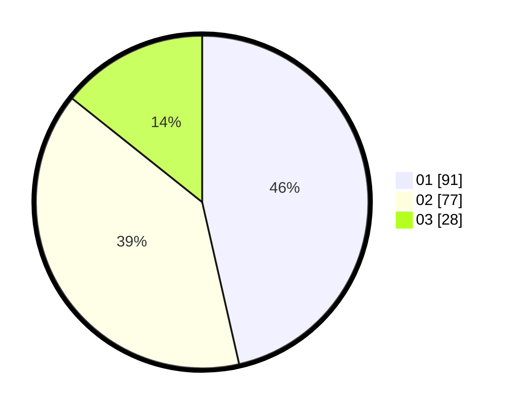

# Hasil

Hasil perolehan suara paslon dapat dilihat pada file paslon-01.txt, paslon-02.txt, dan paslon-03.txt.

Jika tidak ada, artinya data tersebut belum ada pada SIREKAP.

## Perolehan Suara

 * Paslon 01: **91**.
 * Paslon 02: **77**.
 * Paslon 03: **28**.

## Foto C Plano

https://sirekap-obj-formc.kpu.go.id/f666/pemilu/ppwp/31/71/07/10/07/3171071007005-20240217-010413--ed32aeaf-5234-4845-b698-3151025fedeb.jpg

https://sirekap-obj-formc.kpu.go.id/f666/pemilu/ppwp/31/71/07/10/07/3171071007005-20240217-010415--90cd1364-0abd-4d0f-861e-38f6033e6814.jpg

https://sirekap-obj-formc.kpu.go.id/f666/pemilu/ppwp/31/71/07/10/07/3171071007005-20240217-010414--671accf7-e4d4-4475-bd6d-cc2b436cbf43.jpg

## DATA PEMILIH TETAP

Jumlah pemilih dalam DPT: **267**.
 * L: **132**.
 * P: **135**.

## DATA PENGGUNA HAK PILIH

Jumlah pengguna hak pilih dalam DPT: **196**.
 * L: **94**.
 * P: **102**.

Jumlah pengguna hak pilih dalam DPTb: **2**.
 * L: **1**.
 * P: **1**.

Jumlah pengguna hak pilih dalam DPK: **1**.
 * L: **1**.
 * P: **0**.

Jumlah pengguna hak pilih: **199**.
 * L: **96**.
 * P: **103**.

## JUMLAH SUARA SAH DAN TIDAK SAH

JUMLAH SELURUH SUARA SAH: **196**.

JUMLAH SUARA TIDAK SAH: **3**.

JUMLAH SELURUH SUARA SAH DAN SUARA TIDAK SAH: **199**.
