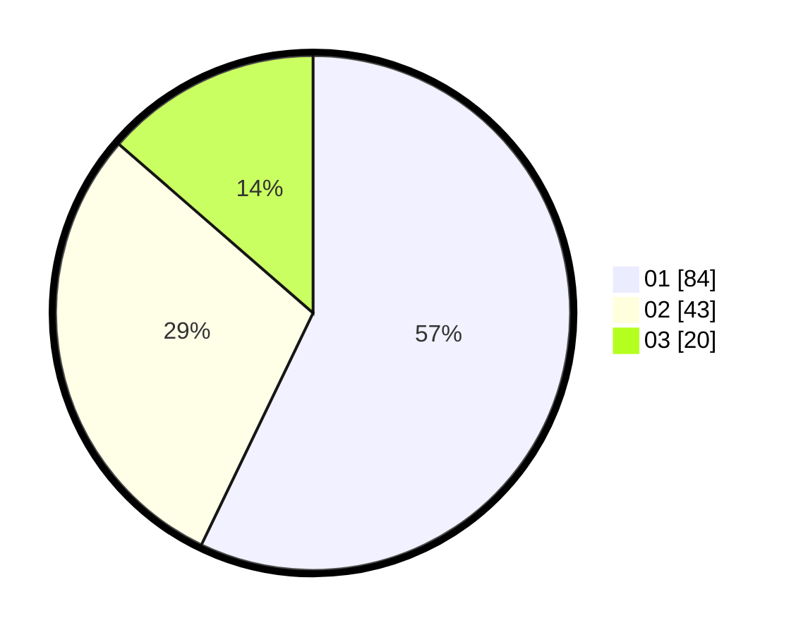

# Hasil

Hasil perolehan suara paslon dapat dilihat pada file paslon-01.txt, paslon-02.txt, dan paslon-03.txt.

Jika tidak ada, artinya data tersebut belum ada pada SIREKAP.

## Perolehan Suara

 * Paslon 01: **84**.
 * Paslon 02: **43**.
 * Paslon 03: **20**.

## Foto C Plano

https://sirekap-obj-formc.kpu.go.id/5247/pemilu/ppwp/31/71/07/10/07/3171071007010-20240216-201410--8216a6d4-c085-404b-b3bc-d4de31032c5d.jpg

https://sirekap-obj-formc.kpu.go.id/5247/pemilu/ppwp/31/71/07/10/07/3171071007010-20240216-202717--52cd7c01-4279-44b5-9384-94595f6be44c.jpg

https://sirekap-obj-formc.kpu.go.id/5247/pemilu/ppwp/31/71/07/10/07/3171071007010-20240216-203714--0a3447bd-645d-411d-819b-24232964c2b7.jpg

## DATA PEMILIH TETAP

Jumlah pemilih dalam DPT: **202**.
 * L: **100**.
 * P: **102**.

## DATA PENGGUNA HAK PILIH

Jumlah pengguna hak pilih dalam DPT: **149**.
 * L: **75**.
 * P: **74**.

Jumlah pengguna hak pilih dalam DPTb: **3**.
 * L: **3**.
 * P: **0**.

Jumlah pengguna hak pilih dalam DPK: **2**.
 * L: **1**.
 * P: **1**.

Jumlah pengguna hak pilih: **154**.
 * L: **79**.
 * P: **75**.

## JUMLAH SUARA SAH DAN TIDAK SAH

JUMLAH SELURUH SUARA SAH: **147**.

JUMLAH SUARA TIDAK SAH: **7**.

JUMLAH SELURUH SUARA SAH DAN SUARA TIDAK SAH: **154**.
