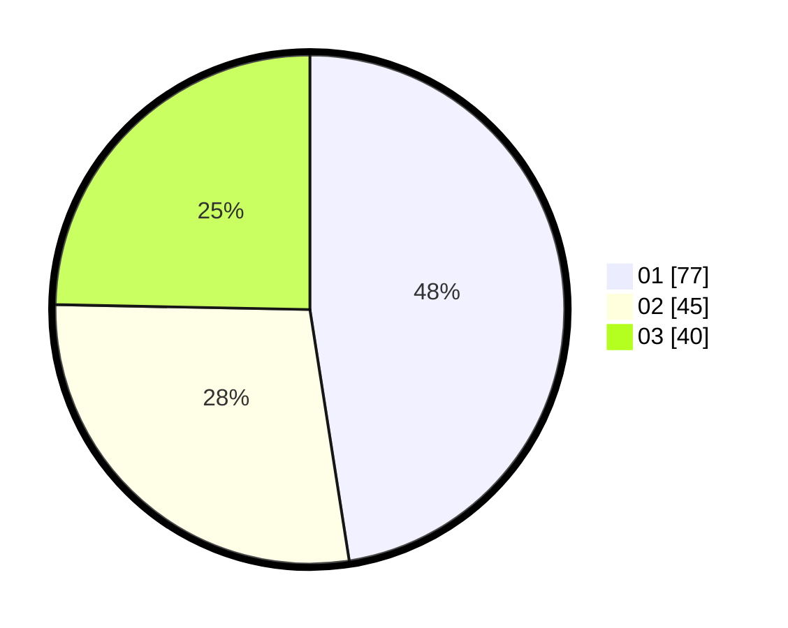

# Hasil

Hasil perolehan suara paslon dapat dilihat pada file paslon-01.txt, paslon-02.txt, dan paslon-03.txt.

Jika tidak ada, artinya data tersebut belum ada pada SIREKAP.

## Perolehan Suara

 * Paslon 01: **77**.
 * Paslon 02: **45**.
 * Paslon 03: **40**.

## Foto C Plano

https://sirekap-obj-formc.kpu.go.id/8403/pemilu/ppwp/31/71/07/10/07/3171071007011-20240217-204933--f0b1e062-2a79-4dfd-9cf7-bc8b4a36f0ca.jpg

https://sirekap-obj-formc.kpu.go.id/8403/pemilu/ppwp/31/71/07/10/07/3171071007011-20240217-205804--7384bd4d-b3a6-47ef-acfb-b1038999b7df.jpg

https://sirekap-obj-formc.kpu.go.id/8403/pemilu/ppwp/31/71/07/10/07/3171071007011-20240217-155205--3aab0428-ea1d-4bbf-a10d-9c7de01ba6de.jpg

## DATA PEMILIH TETAP

Jumlah pemilih dalam DPT: **202**.
 * L: **94**.
 * P: **108**.

## DATA PENGGUNA HAK PILIH

Jumlah pengguna hak pilih dalam DPT: **154**.
 * L: **74**.
 * P: **80**.

Jumlah pengguna hak pilih dalam DPTb: **9**.
 * L: **5**.
 * P: **4**.

Jumlah pengguna hak pilih dalam DPK: **0**.
 * L: **0**.
 * P: **0**.

Jumlah pengguna hak pilih: **163**.
 * L: **79**.
 * P: **84**.

## JUMLAH SUARA SAH DAN TIDAK SAH

JUMLAH SELURUH SUARA SAH: **162**.

JUMLAH SUARA TIDAK SAH: **1**.

JUMLAH SELURUH SUARA SAH DAN SUARA TIDAK SAH: **163**.
