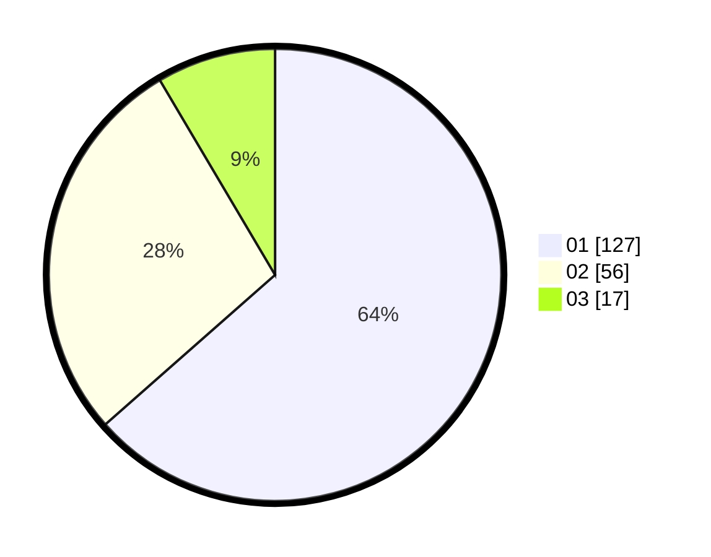

# Hasil

Hasil perolehan suara paslon dapat dilihat pada file paslon-01.txt, paslon-02.txt, dan paslon-03.txt.

Jika tidak ada, artinya data tersebut belum ada pada SIREKAP.

## Perolehan Suara

 * Paslon 01: **127**.
 * Paslon 02: **56**.
 * Paslon 03: **17**.

## Foto C Plano

https://sirekap-obj-formc.kpu.go.id/7a84/pemilu/ppwp/31/71/07/10/07/3171071007012-20240214-155650--e0cfa71f-62b3-4198-bf56-6ea1f7b0cda4.jpg

https://sirekap-obj-formc.kpu.go.id/7a84/pemilu/ppwp/31/71/07/10/07/3171071007012-20240214-155740--ea00bcf0-2766-4233-b896-3daadb8d3841.jpg

https://sirekap-obj-formc.kpu.go.id/7a84/pemilu/ppwp/31/71/07/10/07/3171071007012-20240214-155809--af074d21-557e-4d24-b0e4-60719e2bb482.jpg

## DATA PEMILIH TETAP

Jumlah pemilih dalam DPT: **263**.
 * L: **132**.
 * P: **131**.

## DATA PENGGUNA HAK PILIH

Jumlah pengguna hak pilih dalam DPT: **201**.
 * L: **98**.
 * P: **103**.

Jumlah pengguna hak pilih dalam DPTb: **0**.
 * L: **0**.
 * P: **0**.

Jumlah pengguna hak pilih dalam DPK: **2**.
 * L: **1**.
 * P: **1**.

Jumlah pengguna hak pilih: **203**.
 * L: **99**.
 * P: **104**.

## JUMLAH SUARA SAH DAN TIDAK SAH

JUMLAH SELURUH SUARA SAH: **200**.

JUMLAH SUARA TIDAK SAH: **3**.

JUMLAH SELURUH SUARA SAH DAN SUARA TIDAK SAH: **203**.
