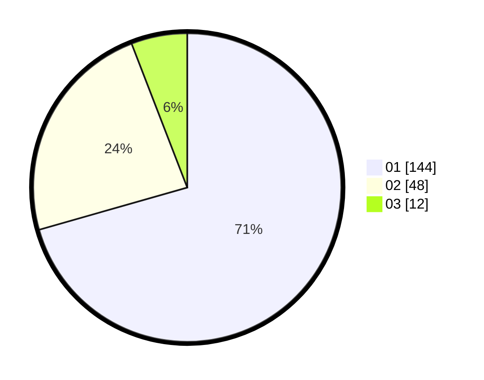

# Hasil

Hasil perolehan suara paslon dapat dilihat pada file paslon-01.txt, paslon-02.txt, dan paslon-03.txt.

Jika tidak ada, artinya data tersebut belum ada pada SIREKAP.

## Perolehan Suara

 * Paslon 01: **144**.
 * Paslon 02: **48**.
 * Paslon 03: **12**.

## Foto C Plano

https://sirekap-obj-formc.kpu.go.id/6022/pemilu/ppwp/31/71/07/10/07/3171071007017-20240215-014633--c2a59734-da84-4df3-976e-8f3a51396622.jpg

https://sirekap-obj-formc.kpu.go.id/6022/pemilu/ppwp/31/71/07/10/07/3171071007017-20240215-014811--61476e96-7b1e-4046-94fd-ed77046985c8.jpg

https://sirekap-obj-formc.kpu.go.id/6022/pemilu/ppwp/31/71/07/10/07/3171071007017-20240215-014951--f93224b2-1396-42a2-85c0-0731b89a4e37.jpg

## DATA PEMILIH TETAP

Jumlah pemilih dalam DPT: **262**.
 * L: **130**.
 * P: **132**.

## DATA PENGGUNA HAK PILIH

Jumlah pengguna hak pilih dalam DPT: **205**.
 * L: **101**.
 * P: **104**.

Jumlah pengguna hak pilih dalam DPTb: **0**.
 * L: **0**.
 * P: **0**.

Jumlah pengguna hak pilih dalam DPK: **0**.
 * L: **0**.
 * P: **0**.

Jumlah pengguna hak pilih: **205**.
 * L: **101**.
 * P: **104**.

## JUMLAH SUARA SAH DAN TIDAK SAH

JUMLAH SELURUH SUARA SAH: **204**.

JUMLAH SUARA TIDAK SAH: **1**.

JUMLAH SELURUH SUARA SAH DAN SUARA TIDAK SAH: **205**.
