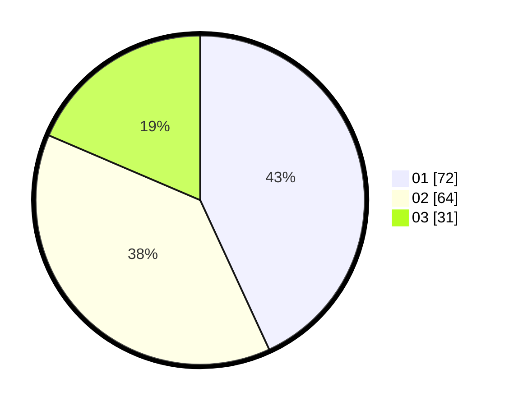

# Hasil

Hasil perolehan suara paslon dapat dilihat pada file paslon-01.txt, paslon-02.txt, dan paslon-03.txt.

Jika tidak ada, artinya data tersebut belum ada pada SIREKAP.

## Perolehan Suara

 * Paslon 01: **72**.
 * Paslon 02: **64**.
 * Paslon 03: **31**.

## Foto C Plano

https://sirekap-obj-formc.kpu.go.id/5989/pemilu/ppwp/31/71/07/10/07/3171071007018-20240214-192956--242b82f0-9e1b-4a45-97fb-262a3da5813f.jpg

https://sirekap-obj-formc.kpu.go.id/5989/pemilu/ppwp/31/71/07/10/07/3171071007018-20240216-120814--2ad714fc-953e-4c41-a87b-39a465b9c153.jpg

https://sirekap-obj-formc.kpu.go.id/5989/pemilu/ppwp/31/71/07/10/07/3171071007018-20240214-193004--904a8fdb-a972-4919-b491-ba188df481ed.jpg

## DATA PEMILIH TETAP

Jumlah pemilih dalam DPT: **226**.
 * L: **122**.
 * P: **104**.

## DATA PENGGUNA HAK PILIH

Jumlah pengguna hak pilih dalam DPT: **169**.
 * L: **84**.
 * P: **85**.

Jumlah pengguna hak pilih dalam DPTb: **0**.
 * L: **0**.
 * P: **0**.

Jumlah pengguna hak pilih dalam DPK: **1**.
 * L: **1**.
 * P: **0**.

Jumlah pengguna hak pilih: **170**.
 * L: **85**.
 * P: **85**.

## JUMLAH SUARA SAH DAN TIDAK SAH

JUMLAH SELURUH SUARA SAH: **167**.

JUMLAH SUARA TIDAK SAH: **3**.

JUMLAH SELURUH SUARA SAH DAN SUARA TIDAK SAH: **170**.
