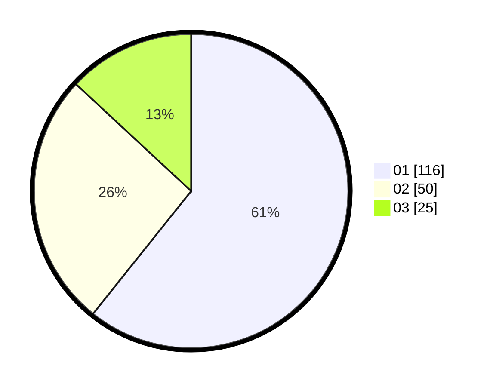

# Hasil

Hasil perolehan suara paslon dapat dilihat pada file paslon-01.txt, paslon-02.txt, dan paslon-03.txt.

Jika tidak ada, artinya data tersebut belum ada pada SIREKAP.

## Perolehan Suara

 * Paslon 01: **116**.
 * Paslon 02: **50**.
 * Paslon 03: **25**.

## Foto C Plano

https://sirekap-obj-formc.kpu.go.id/8fdb/pemilu/ppwp/31/71/07/10/07/3171071007022-20240214-233222--0e50d019-cf30-487f-9e33-ffb6972244f9.jpg

https://sirekap-obj-formc.kpu.go.id/8fdb/pemilu/ppwp/31/71/07/10/07/3171071007022-20240214-232519--33ede30f-8156-4d33-89f7-fe3fd4ce5901.jpg

https://sirekap-obj-formc.kpu.go.id/8fdb/pemilu/ppwp/31/71/07/10/07/3171071007022-20240214-232552--0e0ed7d6-6877-4bf2-ba67-ac47d2f80044.jpg

## DATA PEMILIH TETAP

Jumlah pemilih dalam DPT: **221**.
 * L: **105**.
 * P: **116**.

## DATA PENGGUNA HAK PILIH

Jumlah pengguna hak pilih dalam DPT: **180**.
 * L: **86**.
 * P: **94**.

Jumlah pengguna hak pilih dalam DPTb: **8**.
 * L: **1**.
 * P: **7**.

Jumlah pengguna hak pilih dalam DPK: **4**.
 * L: **2**.
 * P: **2**.

Jumlah pengguna hak pilih: **192**.
 * L: **89**.
 * P: **103**.

## JUMLAH SUARA SAH DAN TIDAK SAH

JUMLAH SELURUH SUARA SAH: **191**.

JUMLAH SUARA TIDAK SAH: **1**.

JUMLAH SELURUH SUARA SAH DAN SUARA TIDAK SAH: **192**.
