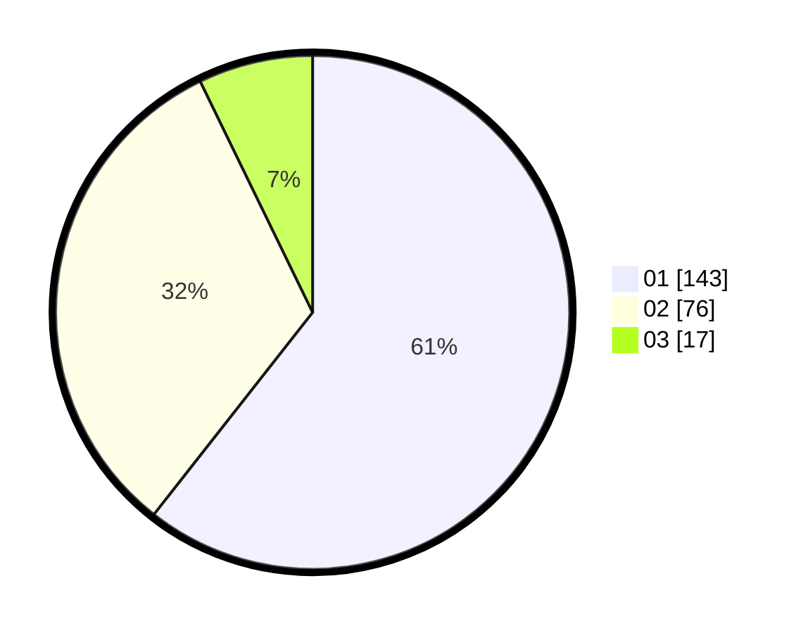

# Hasil

Hasil perolehan suara paslon dapat dilihat pada file paslon-01.txt, paslon-02.txt, dan paslon-03.txt.

Jika tidak ada, artinya data tersebut belum ada pada SIREKAP.

## Perolehan Suara

 * Paslon 01: **143**.
 * Paslon 02: **76**.
 * Paslon 03: **17**.

## Foto C Plano

https://sirekap-obj-formc.kpu.go.id/c0a9/pemilu/ppwp/31/71/07/10/07/3171071007024-20240214-185310--d0176a37-3bad-4c5c-850c-1b2d4dfd8627.jpg

https://sirekap-obj-formc.kpu.go.id/c0a9/pemilu/ppwp/31/71/07/10/07/3171071007024-20240214-185338--f7126f7a-c555-4b41-a190-902c9ef87392.jpg

https://sirekap-obj-formc.kpu.go.id/c0a9/pemilu/ppwp/31/71/07/10/07/3171071007024-20240214-185506--ee7b1980-bdc4-4023-a4e6-34580dfc041e.jpg

## DATA PEMILIH TETAP

Jumlah pemilih dalam DPT: **291**.
 * L: **144**.
 * P: **147**.

## DATA PENGGUNA HAK PILIH

Jumlah pengguna hak pilih dalam DPT: **233**.
 * L: **116**.
 * P: **117**.

Jumlah pengguna hak pilih dalam DPTb: **0**.
 * L: **1**.
 * P: **0**.

Jumlah pengguna hak pilih dalam DPK: **0**.
 * L: **1**.
 * P: **0**.

Jumlah pengguna hak pilih: **235**.
 * L: **118**.
 * P: **117**.

## JUMLAH SUARA SAH DAN TIDAK SAH

JUMLAH SELURUH SUARA SAH: **236**.

JUMLAH SUARA TIDAK SAH: **1**.

JUMLAH SELURUH SUARA SAH DAN SUARA TIDAK SAH: **237**.
