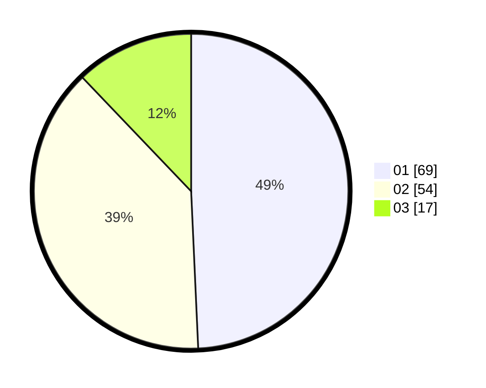

# Hasil

Hasil perolehan suara paslon dapat dilihat pada file paslon-01.txt, paslon-02.txt, dan paslon-03.txt.

Jika tidak ada, artinya data tersebut belum ada pada SIREKAP.

## Perolehan Suara

 * Paslon 01: **69**.
 * Paslon 02: **54**.
 * Paslon 03: **17**.

## Foto C Plano

https://sirekap-obj-formc.kpu.go.id/03c5/pemilu/ppwp/31/71/07/10/07/3171071007033-20240214-214753--0024fa67-3158-434a-93c8-0f5b73b377ca.jpg

https://sirekap-obj-formc.kpu.go.id/03c5/pemilu/ppwp/31/71/07/10/07/3171071007033-20240214-214906--cae957f9-071b-41ce-8880-975c9e3f8c3a.jpg

https://sirekap-obj-formc.kpu.go.id/03c5/pemilu/ppwp/31/71/07/10/07/3171071007033-20240214-215107--e33d6272-6203-42c9-8d3e-d9be173bb368.jpg

## DATA PEMILIH TETAP

Jumlah pemilih dalam DPT: **203**.
 * L: **96**.
 * P: **107**.

## DATA PENGGUNA HAK PILIH

Jumlah pengguna hak pilih dalam DPT: **130**.
 * L: **60**.
 * P: **70**.

Jumlah pengguna hak pilih dalam DPTb: **13**.
 * L: **6**.
 * P: **7**.

Jumlah pengguna hak pilih dalam DPK: **1**.
 * L: **1**.
 * P: **0**.

Jumlah pengguna hak pilih: **144**.
 * L: **67**.
 * P: **77**.

## JUMLAH SUARA SAH DAN TIDAK SAH

JUMLAH SELURUH SUARA SAH: **140**.

JUMLAH SUARA TIDAK SAH: **4**.

JUMLAH SELURUH SUARA SAH DAN SUARA TIDAK SAH: **144**.
