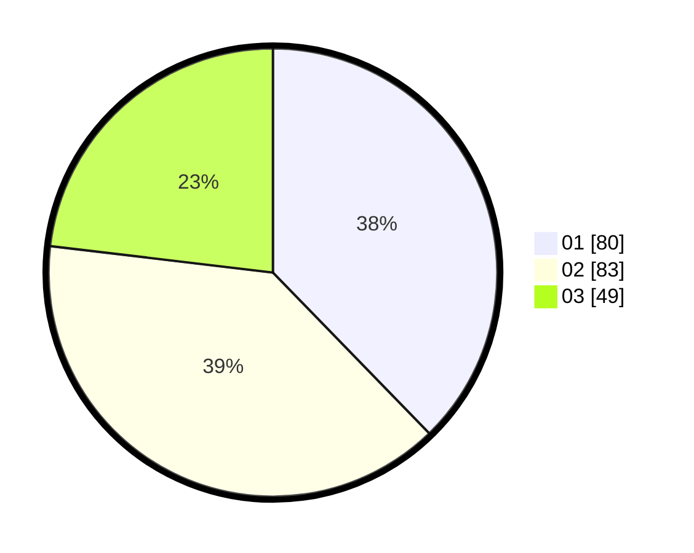

# Hasil

Hasil perolehan suara paslon dapat dilihat pada file paslon-01.txt, paslon-02.txt, dan paslon-03.txt.

Jika tidak ada, artinya data tersebut belum ada pada SIREKAP.

## Perolehan Suara

 * Paslon 01: **80**.
 * Paslon 02: **83**.
 * Paslon 03: **49**.

## Foto C Plano

https://sirekap-obj-formc.kpu.go.id/c501/pemilu/ppwp/31/71/07/10/07/3171071007039-20240214-225924--15e42134-003e-4d45-8a7f-c29bff9c68b6.jpg

https://sirekap-obj-formc.kpu.go.id/c501/pemilu/ppwp/31/71/07/10/07/3171071007039-20240214-230212--30aa2dd7-16d4-4ba6-89a2-28a9e2c08161.jpg

https://sirekap-obj-formc.kpu.go.id/c501/pemilu/ppwp/31/71/07/10/07/3171071007039-20240214-230052--74159026-bdfc-4d87-a37e-94fd2e472be4.jpg

## DATA PEMILIH TETAP

Jumlah pemilih dalam DPT: **265**.
 * L: **114**.
 * P: **151**.

## DATA PENGGUNA HAK PILIH

Jumlah pengguna hak pilih dalam DPT: **182**.
 * L: **64**.
 * P: **118**.

Jumlah pengguna hak pilih dalam DPTb: **32**.
 * L: **7**.
 * P: **25**.

Jumlah pengguna hak pilih dalam DPK: **1**.
 * L: **0**.
 * P: **1**.

Jumlah pengguna hak pilih: **215**.
 * L: **71**.
 * P: **144**.

## JUMLAH SUARA SAH DAN TIDAK SAH

JUMLAH SELURUH SUARA SAH: **212**.

JUMLAH SUARA TIDAK SAH: **3**.

JUMLAH SELURUH SUARA SAH DAN SUARA TIDAK SAH: **215**.
