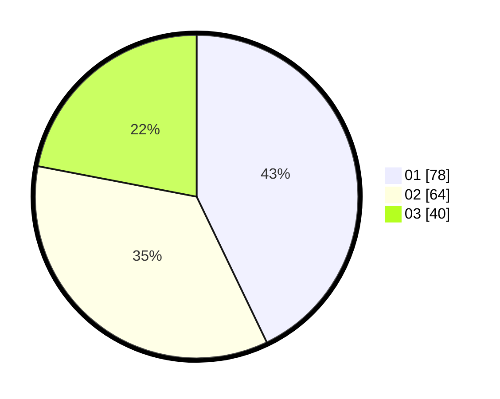

# Hasil

Hasil perolehan suara paslon dapat dilihat pada file paslon-01.txt, paslon-02.txt, dan paslon-03.txt.

Jika tidak ada, artinya data tersebut belum ada pada SIREKAP.

## Perolehan Suara

 * Paslon 01: **78**.
 * Paslon 02: **64**.
 * Paslon 03: **40**.

## Foto C Plano

https://sirekap-obj-formc.kpu.go.id/49fe/pemilu/ppwp/31/71/07/10/07/3171071007040-20240214-190927--13c5b248-ca43-49c3-a869-975157a1f311.jpg

https://sirekap-obj-formc.kpu.go.id/49fe/pemilu/ppwp/31/71/07/10/07/3171071007040-20240214-191002--da895332-018c-4a63-a366-9f4d5c22dbb4.jpg

https://sirekap-obj-formc.kpu.go.id/49fe/pemilu/ppwp/31/71/07/10/07/3171071007040-20240214-191008--a5040306-7e4c-4418-b95b-9799192cdfe5.jpg

## DATA PEMILIH TETAP

Jumlah pemilih dalam DPT: **236**.
 * L: **122**.
 * P: **114**.

## DATA PENGGUNA HAK PILIH

Jumlah pengguna hak pilih dalam DPT: **157**.
 * L: **73**.
 * P: **84**.

Jumlah pengguna hak pilih dalam DPTb: **26**.
 * L: **17**.
 * P: **9**.

Jumlah pengguna hak pilih dalam DPK: **2**.
 * L: **1**.
 * P: **1**.

Jumlah pengguna hak pilih: **185**.
 * L: **91**.
 * P: **94**.

## JUMLAH SUARA SAH DAN TIDAK SAH

JUMLAH SELURUH SUARA SAH: **182**.

JUMLAH SUARA TIDAK SAH: **3**.

JUMLAH SELURUH SUARA SAH DAN SUARA TIDAK SAH: **185**.
