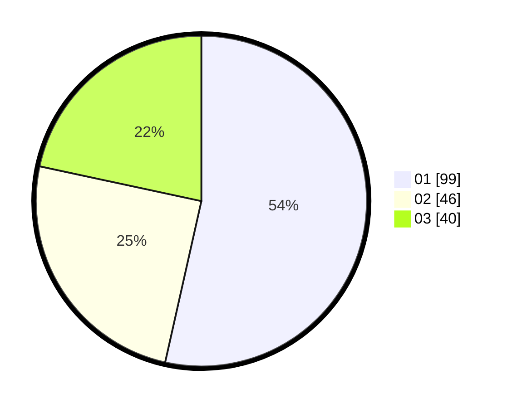

# Hasil

Hasil perolehan suara paslon dapat dilihat pada file paslon-01.txt, paslon-02.txt, dan paslon-03.txt.

Jika tidak ada, artinya data tersebut belum ada pada SIREKAP.

## Perolehan Suara

 * Paslon 01: **99**.
 * Paslon 02: **46**.
 * Paslon 03: **40**.

## Foto C Plano

https://sirekap-obj-formc.kpu.go.id/fc3f/pemilu/ppwp/31/71/07/10/07/3171071007041-20240214-234628--8b6e11fb-e145-4ce3-ba96-962c7cab88f9.jpg

https://sirekap-obj-formc.kpu.go.id/fc3f/pemilu/ppwp/31/71/07/10/07/3171071007041-20240214-234439--f838fbd0-fca2-41d8-a32e-7806f045e5e3.jpg

https://sirekap-obj-formc.kpu.go.id/fc3f/pemilu/ppwp/31/71/07/10/07/3171071007041-20240214-234743--0b8e5d2f-87ea-451e-b6f7-c2ac00a61343.jpg

## DATA PEMILIH TETAP

Jumlah pemilih dalam DPT: **237**.
 * L: **107**.
 * P: **130**.

## DATA PENGGUNA HAK PILIH

Jumlah pengguna hak pilih dalam DPT: **171**.
 * L: **75**.
 * P: **96**.

Jumlah pengguna hak pilih dalam DPTb: **14**.
 * L: **4**.
 * P: **10**.

Jumlah pengguna hak pilih dalam DPK: **0**.
 * L: **0**.
 * P: **0**.

Jumlah pengguna hak pilih: **185**.
 * L: **79**.
 * P: **106**.

## JUMLAH SUARA SAH DAN TIDAK SAH

JUMLAH SELURUH SUARA SAH: **185**.

JUMLAH SUARA TIDAK SAH: **0**.

JUMLAH SELURUH SUARA SAH DAN SUARA TIDAK SAH: **185**.
