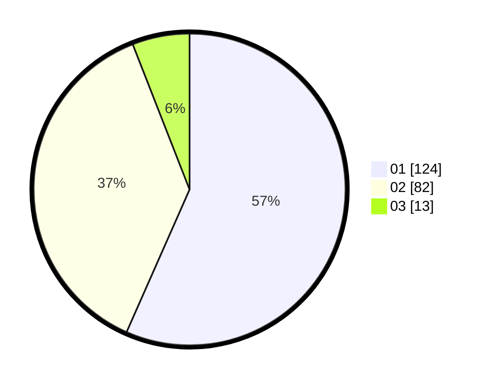

# Hasil

Hasil perolehan suara paslon dapat dilihat pada file paslon-01.txt, paslon-02.txt, dan paslon-03.txt.

Jika tidak ada, artinya data tersebut belum ada pada SIREKAP.

## Perolehan Suara

 * Paslon 01: **124**.
 * Paslon 02: **82**.
 * Paslon 03: **13**.

## Foto C Plano

https://sirekap-obj-formc.kpu.go.id/80fc/pemilu/ppwp/31/71/08/10/01/3171081001001-20240216-142723--e0a31aef-75a5-47b8-90b0-ae786926eaa7.jpg

https://sirekap-obj-formc.kpu.go.id/80fc/pemilu/ppwp/31/71/08/10/01/3171081001001-20240216-142724--cbb3ddf6-1b96-4e7f-867f-229821b24bb5.jpg

https://sirekap-obj-formc.kpu.go.id/80fc/pemilu/ppwp/31/71/08/10/01/3171081001001-20240216-142724--43afc4e1-b49b-4dad-9e14-323ace531083.jpg

## DATA PEMILIH TETAP

Jumlah pemilih dalam DPT: **263**.
 * L: **133**.
 * P: **130**.

## DATA PENGGUNA HAK PILIH

Jumlah pengguna hak pilih dalam DPT: **223**.
 * L: **114**.
 * P: **109**.

Jumlah pengguna hak pilih dalam DPTb: **1**.
 * L: **0**.
 * P: **1**.

Jumlah pengguna hak pilih dalam DPK: **1**.
 * L: **1**.
 * P: **0**.

Jumlah pengguna hak pilih: **225**.
 * L: **115**.
 * P: **110**.

## JUMLAH SUARA SAH DAN TIDAK SAH

JUMLAH SELURUH SUARA SAH: **219**.

JUMLAH SUARA TIDAK SAH: **4**.

JUMLAH SELURUH SUARA SAH DAN SUARA TIDAK SAH: **223**.
