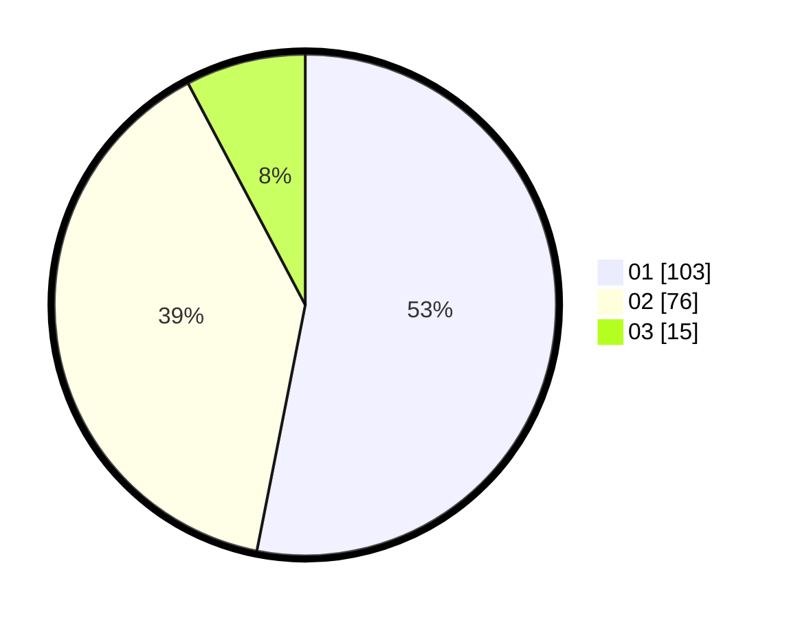

# Hasil

Hasil perolehan suara paslon dapat dilihat pada file paslon-01.txt, paslon-02.txt, dan paslon-03.txt.

Jika tidak ada, artinya data tersebut belum ada pada SIREKAP.

## Perolehan Suara

 * Paslon 01: **103**.
 * Paslon 02: **76**.
 * Paslon 03: **15**.

## Foto C Plano

https://sirekap-obj-formc.kpu.go.id/952c/pemilu/ppwp/31/71/08/10/01/3171081001003-20240216-151507--4801a653-7fc2-4dc9-b5dd-4ec32ca72666.jpg

https://sirekap-obj-formc.kpu.go.id/952c/pemilu/ppwp/31/71/08/10/01/3171081001003-20240216-151508--6c23f4d0-4710-4961-9017-755e16067a81.jpg

https://sirekap-obj-formc.kpu.go.id/952c/pemilu/ppwp/31/71/08/10/01/3171081001003-20240216-151508--f459fa1a-cad9-4f66-a6e9-5c019388b046.jpg

## DATA PEMILIH TETAP

Jumlah pemilih dalam DPT: **196**.
 * L: **94**.
 * P: **102**.

## DATA PENGGUNA HAK PILIH

Jumlah pengguna hak pilih dalam DPT: **194**.
 * L: **94**.
 * P: **100**.

Jumlah pengguna hak pilih dalam DPTb: **1**.
 * L: **0**.
 * P: **1**.

Jumlah pengguna hak pilih dalam DPK: **1**.
 * L: **0**.
 * P: **1**.

Jumlah pengguna hak pilih: **196**.
 * L: **94**.
 * P: **102**.

## JUMLAH SUARA SAH DAN TIDAK SAH

JUMLAH SELURUH SUARA SAH: **194**.

JUMLAH SUARA TIDAK SAH: **2**.

JUMLAH SELURUH SUARA SAH DAN SUARA TIDAK SAH: **196**.
