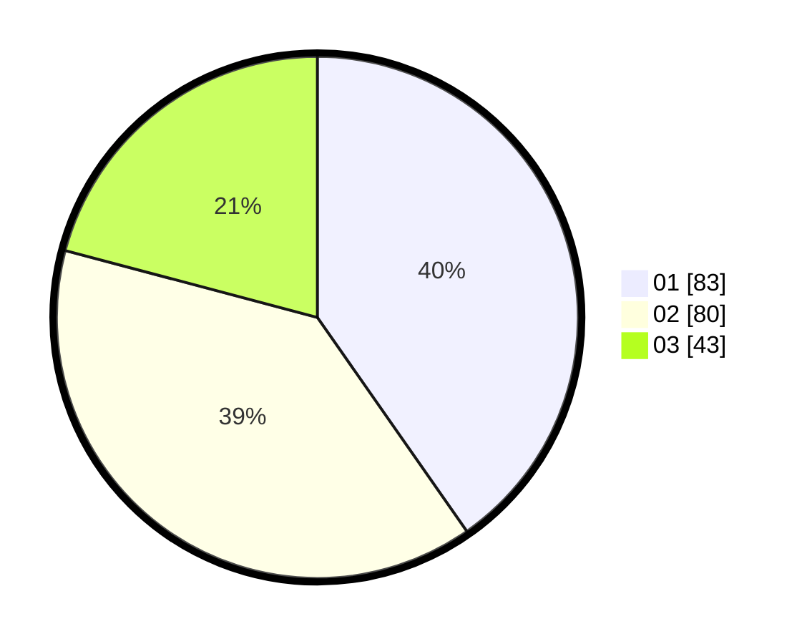

# Hasil

Hasil perolehan suara paslon dapat dilihat pada file paslon-01.txt, paslon-02.txt, dan paslon-03.txt.

Jika tidak ada, artinya data tersebut belum ada pada SIREKAP.

## Perolehan Suara

 * Paslon 01: **83**.
 * Paslon 02: **80**.
 * Paslon 03: **43**.

## Foto C Plano

https://sirekap-obj-formc.kpu.go.id/f3f0/pemilu/ppwp/31/71/08/10/01/3171081001006-20240216-135527--18fec267-f828-4a9f-b9ef-4e20e5d80aa9.jpg

https://sirekap-obj-formc.kpu.go.id/f3f0/pemilu/ppwp/31/71/08/10/01/3171081001006-20240216-135528--bc5a7994-2fa6-44f2-9ee8-44a2c71e1d22.jpg

https://sirekap-obj-formc.kpu.go.id/f3f0/pemilu/ppwp/31/71/08/10/01/3171081001006-20240216-135527--a8e6992a-6c09-4839-9cc4-b9a6c2317cc3.jpg

## DATA PEMILIH TETAP

Jumlah pemilih dalam DPT: **248**.
 * L: **128**.
 * P: **120**.

## DATA PENGGUNA HAK PILIH

Jumlah pengguna hak pilih dalam DPT: **208**.
 * L: **108**.
 * P: **100**.

Jumlah pengguna hak pilih dalam DPTb: **2**.
 * L: **1**.
 * P: **1**.

Jumlah pengguna hak pilih dalam DPK: **0**.
 * L: **0**.
 * P: **0**.

Jumlah pengguna hak pilih: **210**.
 * L: **109**.
 * P: **101**.

## JUMLAH SUARA SAH DAN TIDAK SAH

JUMLAH SELURUH SUARA SAH: **206**.

JUMLAH SUARA TIDAK SAH: **4**.

JUMLAH SELURUH SUARA SAH DAN SUARA TIDAK SAH: **210**.
