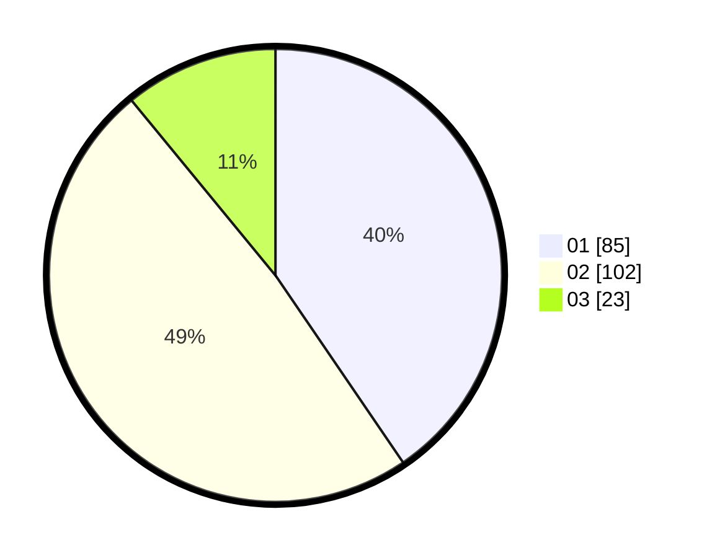

# Hasil

Hasil perolehan suara paslon dapat dilihat pada file paslon-01.txt, paslon-02.txt, dan paslon-03.txt.

Jika tidak ada, artinya data tersebut belum ada pada SIREKAP.

## Perolehan Suara

 * Paslon 01: **85**.
 * Paslon 02: **102**.
 * Paslon 03: **23**.

## Foto C Plano

https://sirekap-obj-formc.kpu.go.id/c743/pemilu/ppwp/31/71/08/10/01/3171081001008-20240216-153156--caf345f6-dc77-4caa-8bd7-ba553cbf5495.jpg

https://sirekap-obj-formc.kpu.go.id/c743/pemilu/ppwp/31/71/08/10/01/3171081001008-20240216-153157--58778681-c042-400c-9492-c2972cc57af1.jpg

https://sirekap-obj-formc.kpu.go.id/c743/pemilu/ppwp/31/71/08/10/01/3171081001008-20240216-153156--4e0e7dd4-37e6-4186-970c-8a0522ecdc4a.jpg

## DATA PEMILIH TETAP

Jumlah pemilih dalam DPT: **267**.
 * L: **136**.
 * P: **131**.

## DATA PENGGUNA HAK PILIH

Jumlah pengguna hak pilih dalam DPT: **209**.
 * L: **106**.
 * P: **103**.

Jumlah pengguna hak pilih dalam DPTb: **2**.
 * L: **0**.
 * P: **2**.

Jumlah pengguna hak pilih dalam DPK: **4**.
 * L: **1**.
 * P: **3**.

Jumlah pengguna hak pilih: **215**.
 * L: **107**.
 * P: **108**.

## JUMLAH SUARA SAH DAN TIDAK SAH

JUMLAH SELURUH SUARA SAH: **210**.

JUMLAH SUARA TIDAK SAH: **5**.

JUMLAH SELURUH SUARA SAH DAN SUARA TIDAK SAH: **215**.
