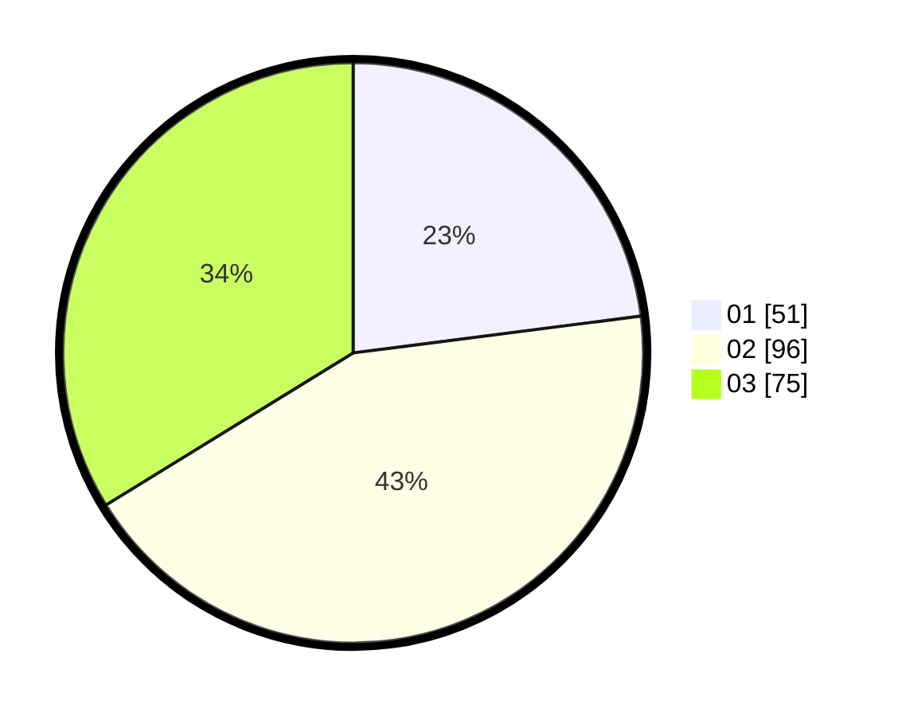

# Hasil

Hasil perolehan suara paslon dapat dilihat pada file paslon-01.txt, paslon-02.txt, dan paslon-03.txt.

Jika tidak ada, artinya data tersebut belum ada pada SIREKAP.

## Perolehan Suara

 * Paslon 01: **51**.
 * Paslon 02: **96**.
 * Paslon 03: **75**.

## Foto C Plano

https://sirekap-obj-formc.kpu.go.id/f965/pemilu/ppwp/31/71/08/10/01/3171081001013-20240216-171755--db842951-51b5-421b-80cb-655c38a024f3.jpg

https://sirekap-obj-formc.kpu.go.id/f965/pemilu/ppwp/31/71/08/10/01/3171081001013-20240216-171756--1df539cc-12cb-4693-b9c6-e84cfe45e835.jpg

https://sirekap-obj-formc.kpu.go.id/f965/pemilu/ppwp/31/71/08/10/01/3171081001013-20240216-171755--aa284f7a-e0cb-4c45-92ce-e88516e21953.jpg

## DATA PEMILIH TETAP

Jumlah pemilih dalam DPT: **274**.
 * L: **122**.
 * P: **152**.

## DATA PENGGUNA HAK PILIH

Jumlah pengguna hak pilih dalam DPT: **195**.
 * L: **87**.
 * P: **108**.

Jumlah pengguna hak pilih dalam DPTb: **23**.
 * L: **14**.
 * P: **9**.

Jumlah pengguna hak pilih dalam DPK: **5**.
 * L: **2**.
 * P: **3**.

Jumlah pengguna hak pilih: **223**.
 * L: **103**.
 * P: **120**.

## JUMLAH SUARA SAH DAN TIDAK SAH

JUMLAH SELURUH SUARA SAH: **222**.

JUMLAH SUARA TIDAK SAH: **1**.

JUMLAH SELURUH SUARA SAH DAN SUARA TIDAK SAH: **223**.
