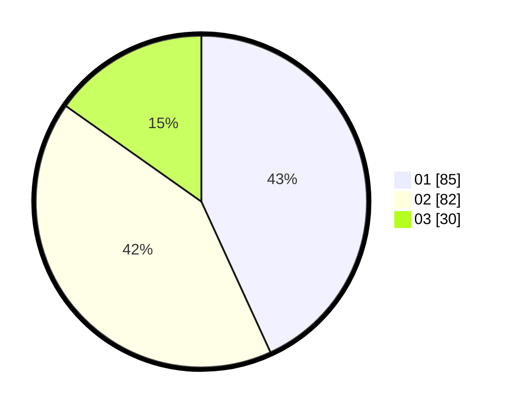

# Hasil

Hasil perolehan suara paslon dapat dilihat pada file paslon-01.txt, paslon-02.txt, dan paslon-03.txt.

Jika tidak ada, artinya data tersebut belum ada pada SIREKAP.

## Perolehan Suara

 * Paslon 01: **85**.
 * Paslon 02: **82**.
 * Paslon 03: **30**.

## Foto C Plano

https://sirekap-obj-formc.kpu.go.id/31e0/pemilu/ppwp/31/71/08/10/01/3171081001014-20240216-161709--15ff32ac-58ec-4b69-94d5-f336a7d78192.jpg

https://sirekap-obj-formc.kpu.go.id/31e0/pemilu/ppwp/31/71/08/10/01/3171081001014-20240214-155051--3941c439-5b2e-49d2-93c0-c9d23c33fec7.jpg

https://sirekap-obj-formc.kpu.go.id/31e0/pemilu/ppwp/31/71/08/10/01/3171081001014-20240216-161709--c89bacf7-6789-4bf5-b2b4-27917166def9.jpg

## DATA PEMILIH TETAP

Jumlah pemilih dalam DPT: **271**.
 * L: **141**.
 * P: **130**.

## DATA PENGGUNA HAK PILIH

Jumlah pengguna hak pilih dalam DPT: **205**.
 * L: **108**.
 * P: **97**.

Jumlah pengguna hak pilih dalam DPTb: **0**.
 * L: **0**.
 * P: **0**.

Jumlah pengguna hak pilih dalam DPK: **0**.
 * L: **0**.
 * P: **0**.

Jumlah pengguna hak pilih: **205**.
 * L: **108**.
 * P: **97**.

## JUMLAH SUARA SAH DAN TIDAK SAH

JUMLAH SELURUH SUARA SAH: **197**.

JUMLAH SUARA TIDAK SAH: **8**.

JUMLAH SELURUH SUARA SAH DAN SUARA TIDAK SAH: **205**.
