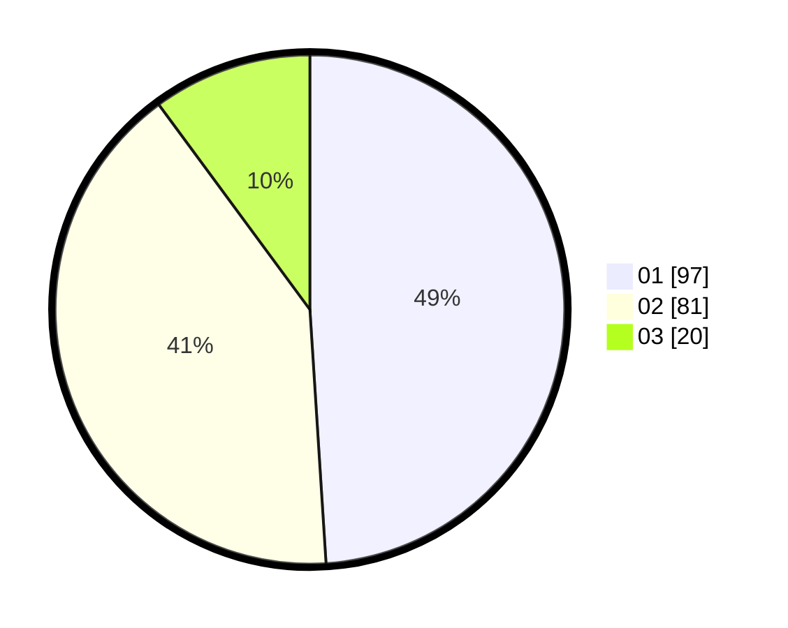

# Hasil

Hasil perolehan suara paslon dapat dilihat pada file paslon-01.txt, paslon-02.txt, dan paslon-03.txt.

Jika tidak ada, artinya data tersebut belum ada pada SIREKAP.

## Perolehan Suara

 * Paslon 01: **97**.
 * Paslon 02: **81**.
 * Paslon 03: **20**.

## Foto C Plano

https://sirekap-obj-formc.kpu.go.id/9da8/pemilu/ppwp/31/71/08/10/01/3171081001018-20240216-151314--4dec2134-de12-4629-9912-51bc889de65b.jpg

https://sirekap-obj-formc.kpu.go.id/9da8/pemilu/ppwp/31/71/08/10/01/3171081001018-20240216-151315--ce0ff1bb-4a78-4ecf-a250-5ca05c81895a.jpg

https://sirekap-obj-formc.kpu.go.id/9da8/pemilu/ppwp/31/71/08/10/01/3171081001018-20240216-151315--d51c3763-af6a-46b8-b4de-d47478d72e77.jpg

## DATA PEMILIH TETAP

Jumlah pemilih dalam DPT: **255**.
 * L: **139**.
 * P: **116**.

## DATA PENGGUNA HAK PILIH

Jumlah pengguna hak pilih dalam DPT: **199**.
 * L: **106**.
 * P: **93**.

Jumlah pengguna hak pilih dalam DPTb: **0**.
 * L: **0**.
 * P: **0**.

Jumlah pengguna hak pilih dalam DPK: **2**.
 * L: **1**.
 * P: **1**.

Jumlah pengguna hak pilih: **201**.
 * L: **107**.
 * P: **94**.

## JUMLAH SUARA SAH DAN TIDAK SAH

JUMLAH SELURUH SUARA SAH: **198**.

JUMLAH SUARA TIDAK SAH: **3**.

JUMLAH SELURUH SUARA SAH DAN SUARA TIDAK SAH: **201**.
