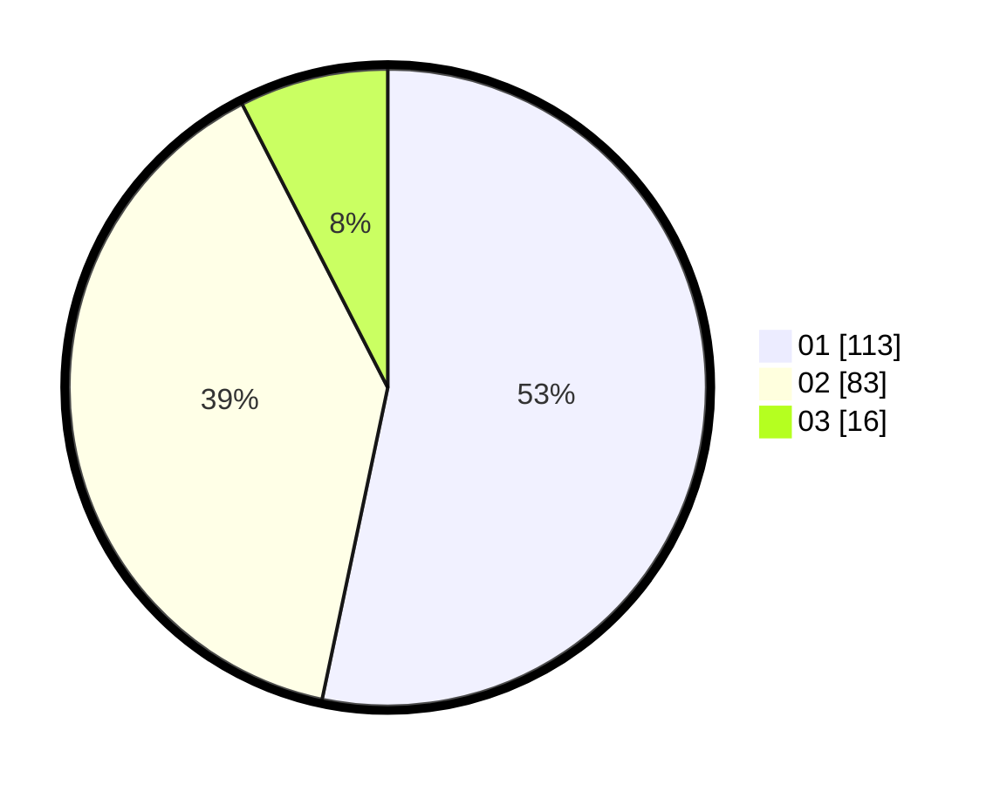

# Hasil

Hasil perolehan suara paslon dapat dilihat pada file paslon-01.txt, paslon-02.txt, dan paslon-03.txt.

Jika tidak ada, artinya data tersebut belum ada pada SIREKAP.

## Perolehan Suara

 * Paslon 01: **113**.
 * Paslon 02: **83**.
 * Paslon 03: **16**.

## Foto C Plano

https://sirekap-obj-formc.kpu.go.id/4f7b/pemilu/ppwp/31/71/08/10/01/3171081001020-20240216-153437--dd89c7b5-6f94-4b12-8f38-622de4c9ef14.jpg

https://sirekap-obj-formc.kpu.go.id/4f7b/pemilu/ppwp/31/71/08/10/01/3171081001020-20240216-153438--7fb92cd8-a15e-4140-a4e9-dd9bc1190116.jpg

https://sirekap-obj-formc.kpu.go.id/4f7b/pemilu/ppwp/31/71/08/10/01/3171081001020-20240216-153437--922a1d3b-df80-4dc2-8efd-eaf20422e5a2.jpg

## DATA PEMILIH TETAP

Jumlah pemilih dalam DPT: **254**.
 * L: **128**.
 * P: **126**.

## DATA PENGGUNA HAK PILIH

Jumlah pengguna hak pilih dalam DPT: **210**.
 * L: **103**.
 * P: **107**.

Jumlah pengguna hak pilih dalam DPTb: **2**.
 * L: **1**.
 * P: **1**.

Jumlah pengguna hak pilih dalam DPK: **0**.
 * L: **0**.
 * P: **0**.

Jumlah pengguna hak pilih: **212**.
 * L: **104**.
 * P: **108**.

## JUMLAH SUARA SAH DAN TIDAK SAH

JUMLAH SELURUH SUARA SAH: **212**.

JUMLAH SUARA TIDAK SAH: **0**.

JUMLAH SELURUH SUARA SAH DAN SUARA TIDAK SAH: **212**.
