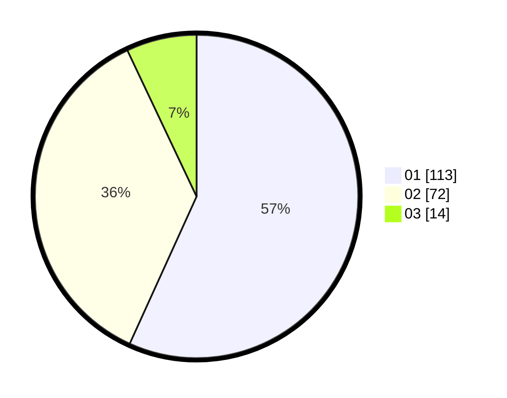

# Hasil

Hasil perolehan suara paslon dapat dilihat pada file paslon-01.txt, paslon-02.txt, dan paslon-03.txt.

Jika tidak ada, artinya data tersebut belum ada pada SIREKAP.

## Perolehan Suara

 * Paslon 01: **113**.
 * Paslon 02: **72**.
 * Paslon 03: **14**.

## Foto C Plano

https://sirekap-obj-formc.kpu.go.id/540a/pemilu/ppwp/31/71/08/10/01/3171081001023-20240216-135205--89e2e486-e407-4c30-93ed-c02d09cdc3e1.jpg

https://sirekap-obj-formc.kpu.go.id/540a/pemilu/ppwp/31/71/08/10/01/3171081001023-20240216-135208--32e96b2d-4c6f-448a-a6ff-46a1cba891b1.jpg

https://sirekap-obj-formc.kpu.go.id/540a/pemilu/ppwp/31/71/08/10/01/3171081001023-20240216-135206--d058410e-7ba3-4d59-b55a-3a0f3e3b7ef3.jpg

## DATA PEMILIH TETAP

Jumlah pemilih dalam DPT: **268**.
 * L: **140**.
 * P: **128**.

## DATA PENGGUNA HAK PILIH

Jumlah pengguna hak pilih dalam DPT: **268**.
 * L: **140**.
 * P: **128**.

Jumlah pengguna hak pilih dalam DPTb: **0**.
 * L: **0**.
 * P: **0**.

Jumlah pengguna hak pilih dalam DPK: **0**.
 * L: **0**.
 * P: **0**.

Jumlah pengguna hak pilih: **268**.
 * L: **140**.
 * P: **128**.

## JUMLAH SUARA SAH DAN TIDAK SAH

JUMLAH SELURUH SUARA SAH: **199**.

JUMLAH SUARA TIDAK SAH: **3**.

JUMLAH SELURUH SUARA SAH DAN SUARA TIDAK SAH: **202**.
