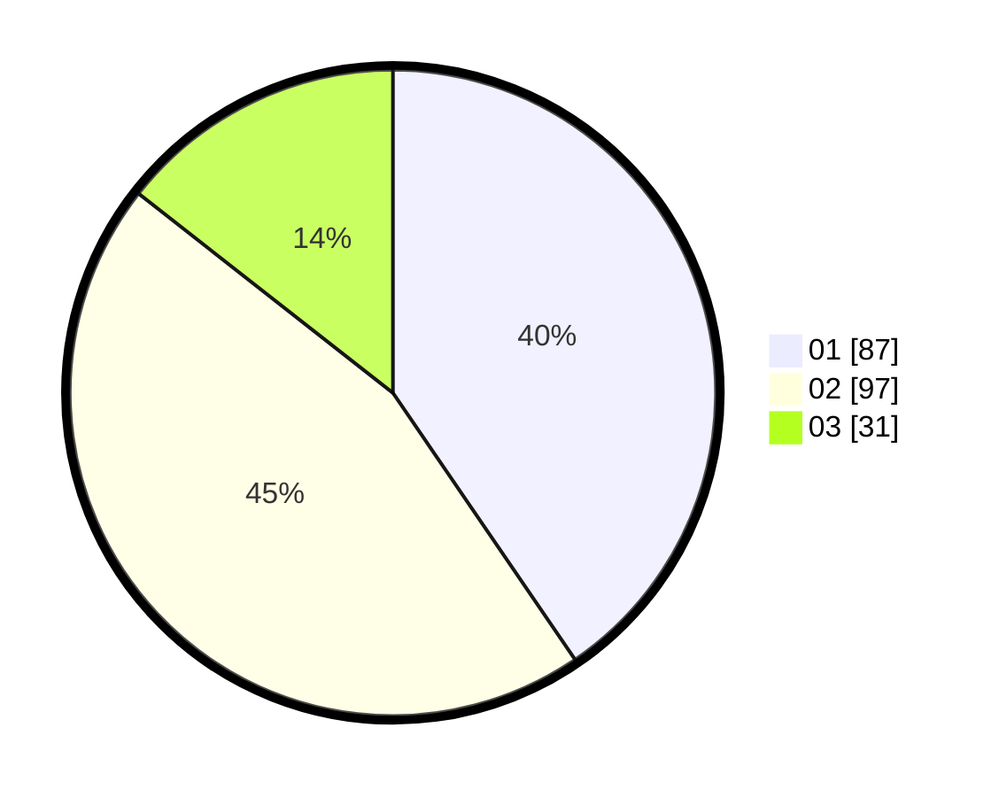

# Hasil

Hasil perolehan suara paslon dapat dilihat pada file paslon-01.txt, paslon-02.txt, dan paslon-03.txt.

Jika tidak ada, artinya data tersebut belum ada pada SIREKAP.

## Perolehan Suara

 * Paslon 01: **87**.
 * Paslon 02: **97**.
 * Paslon 03: **31**.

## Foto C Plano

https://sirekap-obj-formc.kpu.go.id/4eb5/pemilu/ppwp/31/71/08/10/01/3171081001028-20240216-170834--3c0dcce5-44e1-426d-9c6e-d90ba84dd678.jpg

https://sirekap-obj-formc.kpu.go.id/4eb5/pemilu/ppwp/31/71/08/10/01/3171081001028-20240216-170836--e8d91149-ebb1-4276-be3f-9e72d1d141a8.jpg

https://sirekap-obj-formc.kpu.go.id/4eb5/pemilu/ppwp/31/71/08/10/01/3171081001028-20240216-170835--20fb4849-73b0-4984-96b9-ec050eec7f25.jpg

## DATA PEMILIH TETAP

Jumlah pemilih dalam DPT: **271**.
 * L: **133**.
 * P: **138**.

## DATA PENGGUNA HAK PILIH

Jumlah pengguna hak pilih dalam DPT: **217**.
 * L: **103**.
 * P: **114**.

Jumlah pengguna hak pilih dalam DPTb: **2**.
 * L: **2**.
 * P: **0**.

Jumlah pengguna hak pilih dalam DPK: **1**.
 * L: **1**.
 * P: **0**.

Jumlah pengguna hak pilih: **220**.
 * L: **106**.
 * P: **114**.

## JUMLAH SUARA SAH DAN TIDAK SAH

JUMLAH SELURUH SUARA SAH: **215**.

JUMLAH SUARA TIDAK SAH: **5**.

JUMLAH SELURUH SUARA SAH DAN SUARA TIDAK SAH: **220**.
