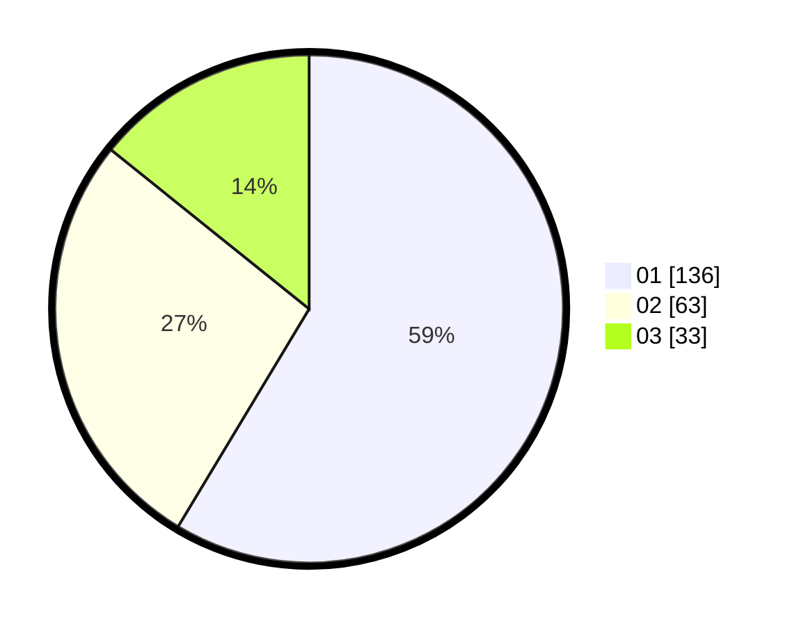

# Hasil

Hasil perolehan suara paslon dapat dilihat pada file paslon-01.txt, paslon-02.txt, dan paslon-03.txt.

Jika tidak ada, artinya data tersebut belum ada pada SIREKAP.

## Perolehan Suara

 * Paslon 01: **136**.
 * Paslon 02: **63**.
 * Paslon 03: **33**.

## Foto C Plano

https://sirekap-obj-formc.kpu.go.id/63d8/pemilu/ppwp/31/71/08/10/01/3171081001030-20240216-150859--4fc0fa74-8482-4445-9348-5df9e30d88e7.jpg

https://sirekap-obj-formc.kpu.go.id/63d8/pemilu/ppwp/31/71/08/10/01/3171081001030-20240216-150900--dfbaca36-394d-4de3-bccb-b30dfa424440.jpg

https://sirekap-obj-formc.kpu.go.id/63d8/pemilu/ppwp/31/71/08/10/01/3171081001030-20240216-150900--31bcdd64-6df3-47d6-b741-ac199cb28029.jpg

## DATA PEMILIH TETAP

Jumlah pemilih dalam DPT: **237**.
 * L: **105**.
 * P: **132**.

## DATA PENGGUNA HAK PILIH

Jumlah pengguna hak pilih dalam DPT: **235**.
 * L: **103**.
 * P: **132**.

Jumlah pengguna hak pilih dalam DPTb: **0**.
 * L: **0**.
 * P: **0**.

Jumlah pengguna hak pilih dalam DPK: **2**.
 * L: **2**.
 * P: **0**.

Jumlah pengguna hak pilih: **237**.
 * L: **105**.
 * P: **132**.

## JUMLAH SUARA SAH DAN TIDAK SAH

JUMLAH SELURUH SUARA SAH: **232**.

JUMLAH SUARA TIDAK SAH: **5**.

JUMLAH SELURUH SUARA SAH DAN SUARA TIDAK SAH: **237**.
