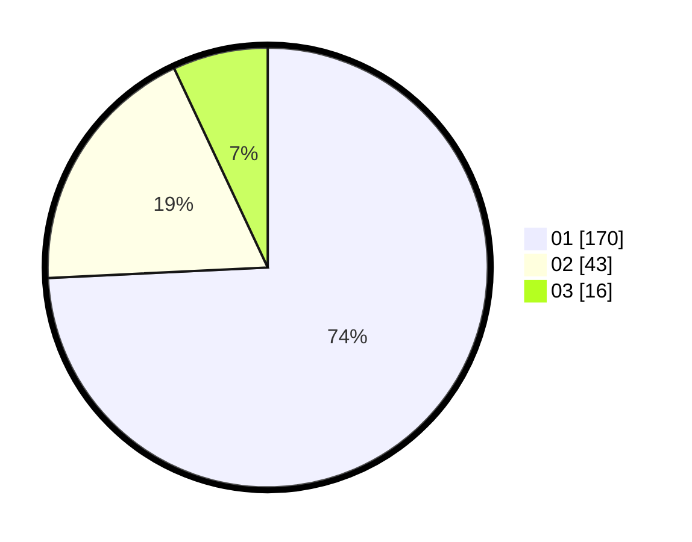

# Hasil

Hasil perolehan suara paslon dapat dilihat pada file paslon-01.txt, paslon-02.txt, dan paslon-03.txt.

Jika tidak ada, artinya data tersebut belum ada pada SIREKAP.

## Perolehan Suara

 * Paslon 01: **170**.
 * Paslon 02: **43**.
 * Paslon 03: **16**.

## Foto C Plano

https://sirekap-obj-formc.kpu.go.id/fe87/pemilu/ppwp/31/71/08/10/01/3171081001031-20240216-065720--653b2cbe-89f6-4052-b2a7-facdfb038eac.jpg

https://sirekap-obj-formc.kpu.go.id/fe87/pemilu/ppwp/31/71/08/10/01/3171081001031-20240216-023036--8439164a-4eb3-44ef-a5c0-c1f4f619804f.jpg

https://sirekap-obj-formc.kpu.go.id/fe87/pemilu/ppwp/31/71/08/10/01/3171081001031-20240216-065721--ed25bcbf-147e-4f9c-a72b-a96722c879b7.jpg

## DATA PEMILIH TETAP

Jumlah pemilih dalam DPT: **270**.
 * L: **136**.
 * P: **134**.

## DATA PENGGUNA HAK PILIH

Jumlah pengguna hak pilih dalam DPT: **220**.
 * L: **109**.
 * P: **111**.

Jumlah pengguna hak pilih dalam DPTb: **4**.
 * L: **1**.
 * P: **3**.

Jumlah pengguna hak pilih dalam DPK: **6**.
 * L: **2**.
 * P: **4**.

Jumlah pengguna hak pilih: **230**.
 * L: **112**.
 * P: **118**.

## JUMLAH SUARA SAH DAN TIDAK SAH

JUMLAH SELURUH SUARA SAH: **229**.

JUMLAH SUARA TIDAK SAH: **1**.

JUMLAH SELURUH SUARA SAH DAN SUARA TIDAK SAH: **230**.
