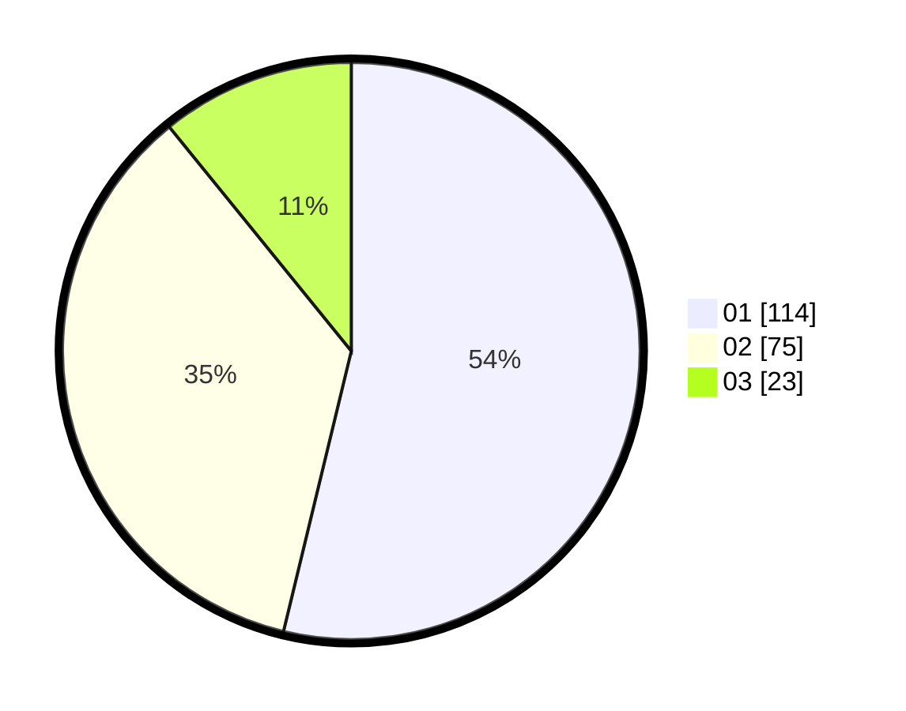

# Hasil

Hasil perolehan suara paslon dapat dilihat pada file paslon-01.txt, paslon-02.txt, dan paslon-03.txt.

Jika tidak ada, artinya data tersebut belum ada pada SIREKAP.

## Perolehan Suara

 * Paslon 01: **114**.
 * Paslon 02: **75**.
 * Paslon 03: **23**.

## Foto C Plano

https://sirekap-obj-formc.kpu.go.id/a8a6/pemilu/ppwp/31/71/08/10/01/3171081001038-20240216-170352--2457b8e4-fa10-4e76-b9b8-528622472478.jpg

https://sirekap-obj-formc.kpu.go.id/a8a6/pemilu/ppwp/31/71/08/10/01/3171081001038-20240216-170353--07fee383-09db-4454-ba7c-a6e4685dade7.jpg

https://sirekap-obj-formc.kpu.go.id/a8a6/pemilu/ppwp/31/71/08/10/01/3171081001038-20240216-170352--94c94a01-f932-43d1-a09e-fa5ddf2a169f.jpg

## DATA PEMILIH TETAP

Jumlah pemilih dalam DPT: **275**.
 * L: **140**.
 * P: **135**.

## DATA PENGGUNA HAK PILIH

Jumlah pengguna hak pilih dalam DPT: **203**.
 * L: **108**.
 * P: **95**.

Jumlah pengguna hak pilih dalam DPTb: **9**.
 * L: **4**.
 * P: **5**.

Jumlah pengguna hak pilih dalam DPK: **3**.
 * L: **1**.
 * P: **2**.

Jumlah pengguna hak pilih: **215**.
 * L: **113**.
 * P: **102**.

## JUMLAH SUARA SAH DAN TIDAK SAH

JUMLAH SELURUH SUARA SAH: **212**.

JUMLAH SUARA TIDAK SAH: **3**.

JUMLAH SELURUH SUARA SAH DAN SUARA TIDAK SAH: **215**.
