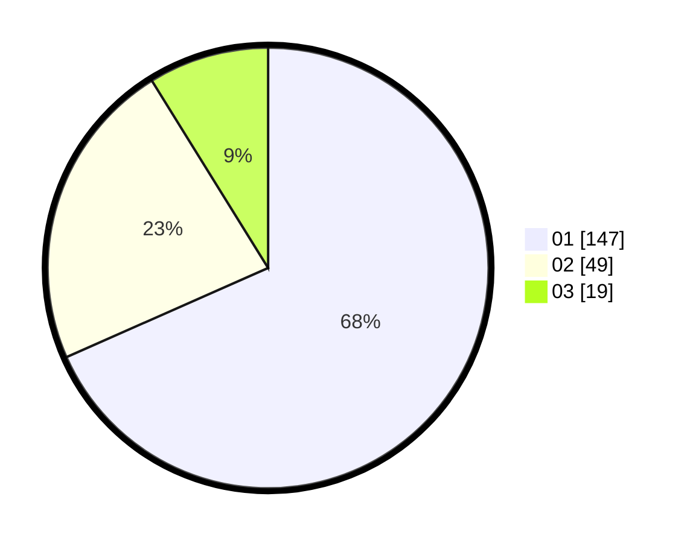

# Hasil

Hasil perolehan suara paslon dapat dilihat pada file paslon-01.txt, paslon-02.txt, dan paslon-03.txt.

Jika tidak ada, artinya data tersebut belum ada pada SIREKAP.

## Perolehan Suara

 * Paslon 01: **147**.
 * Paslon 02: **49**.
 * Paslon 03: **19**.

## Foto C Plano

https://sirekap-obj-formc.kpu.go.id/5ac8/pemilu/ppwp/31/71/08/10/01/3171081001041-20240216-162127--54ca1665-97c5-489c-8a08-cc5d4f03805a.jpg

https://sirekap-obj-formc.kpu.go.id/5ac8/pemilu/ppwp/31/71/08/10/01/3171081001041-20240216-162129--ebde3f61-4e06-4762-b093-200c97ba9409.jpg

https://sirekap-obj-formc.kpu.go.id/5ac8/pemilu/ppwp/31/71/08/10/01/3171081001041-20240216-162128--132f8e57-ad39-4adf-8ccf-7e3186e2111a.jpg

## DATA PEMILIH TETAP

Jumlah pemilih dalam DPT: **271**.
 * L: **118**.
 * P: **153**.

## DATA PENGGUNA HAK PILIH

Jumlah pengguna hak pilih dalam DPT: **209**.
 * L: **85**.
 * P: **124**.

Jumlah pengguna hak pilih dalam DPTb: **1**.
 * L: **1**.
 * P: **0**.

Jumlah pengguna hak pilih dalam DPK: **7**.
 * L: **4**.
 * P: **3**.

Jumlah pengguna hak pilih: **217**.
 * L: **90**.
 * P: **127**.

## JUMLAH SUARA SAH DAN TIDAK SAH

JUMLAH SELURUH SUARA SAH: **215**.

JUMLAH SUARA TIDAK SAH: **2**.

JUMLAH SELURUH SUARA SAH DAN SUARA TIDAK SAH: **217**.
